# 实验一总结：简单算法设计

---

## 目录

1. [相等元素问题 - 哈希表原理](#相等元素问题---哈希表原理)
2. [整数集合分解 - 快速排序原理](#整数集合分解---快速排序原理)
3. [实验总结](#实验总结)

---

## 相等元素问题 - 哈希表原理

### 问题本质分析

相等元素问题的核心是**元素查找与判重**。我们需要高效地判断一个元素是否已经出现过。

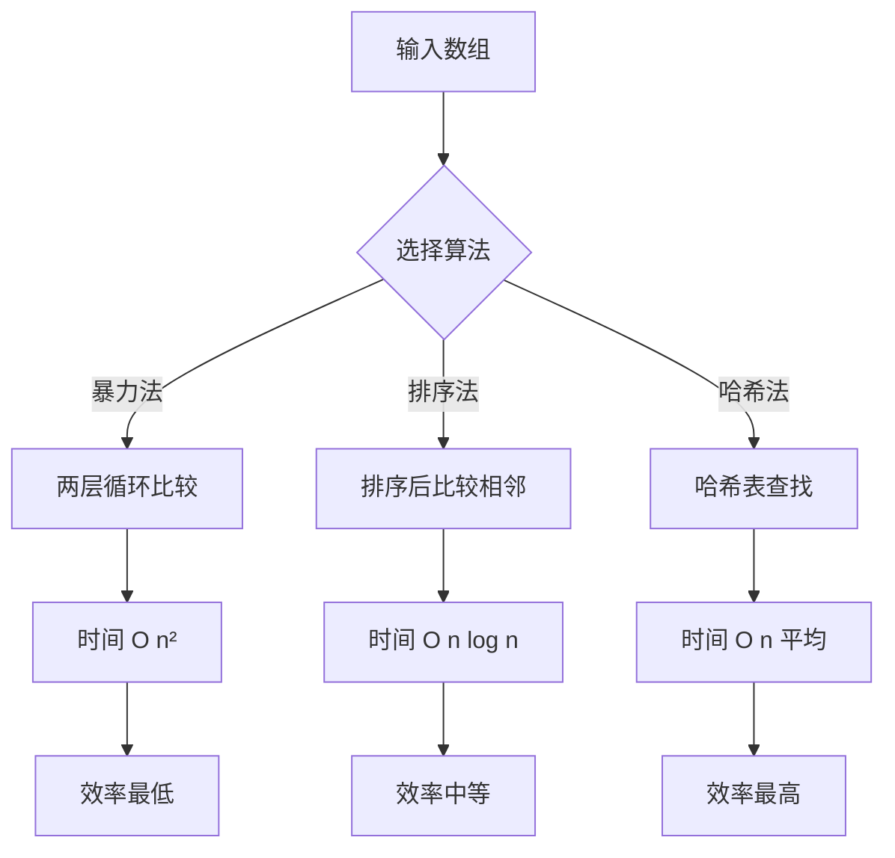

### 哈希表核心原理

哈希表通过**哈希函数**将元素映射到固定位置，实现O(1)的平均查找时间。

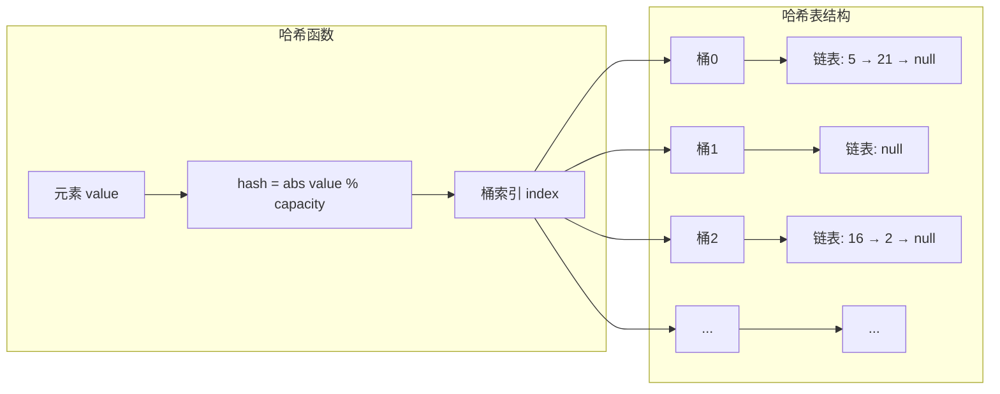

### 链地址法解决冲突

当多个元素映射到同一桶时，使用链表存储所有冲突元素：

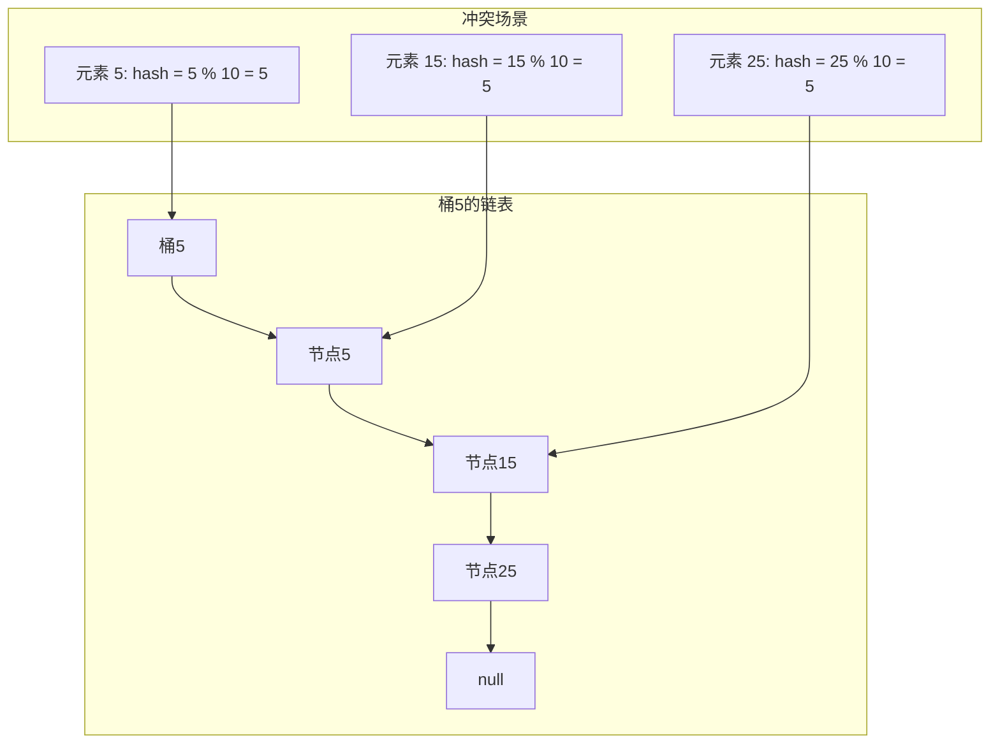

### 添加元素流程

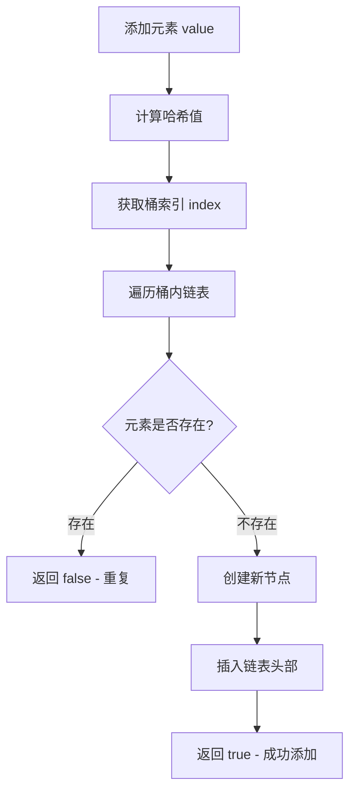

### 时间复杂度分析

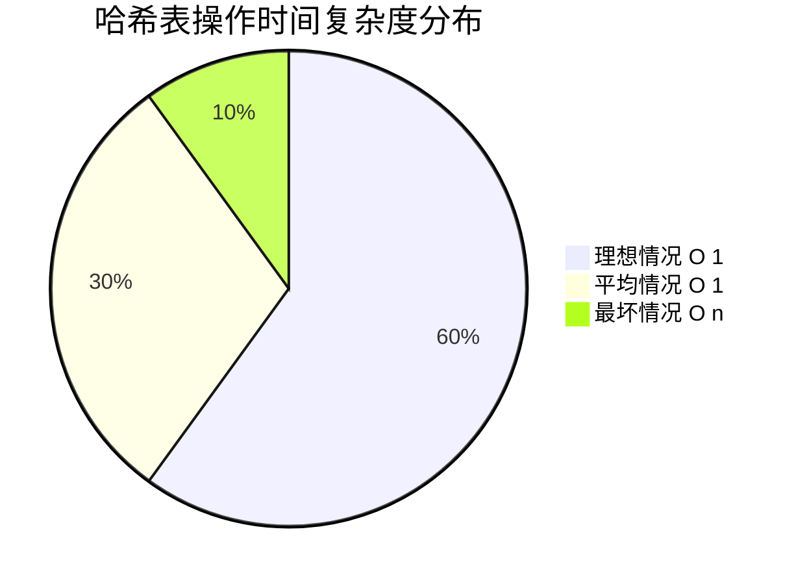

| 场景 | 时间复杂度 | 说明 |
|------|------------|------|
| 理想情况 | O(1) | 无冲突，直接定位 |
| 平均情况 | O(1) | 少量冲突，链表长度有限 |
| 最坏情况 | O(n) | 所有元素冲突到同一桶 |

### 哈希函数设计原则

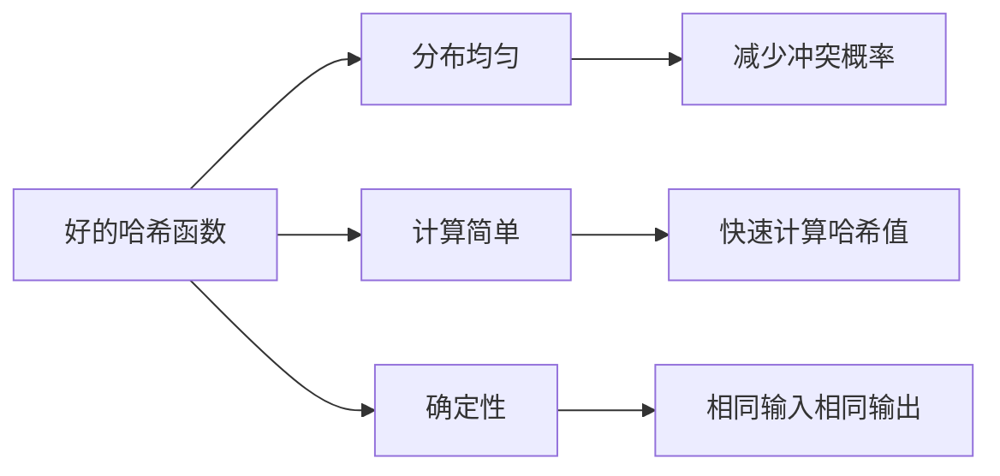

### 哈希表实现要点

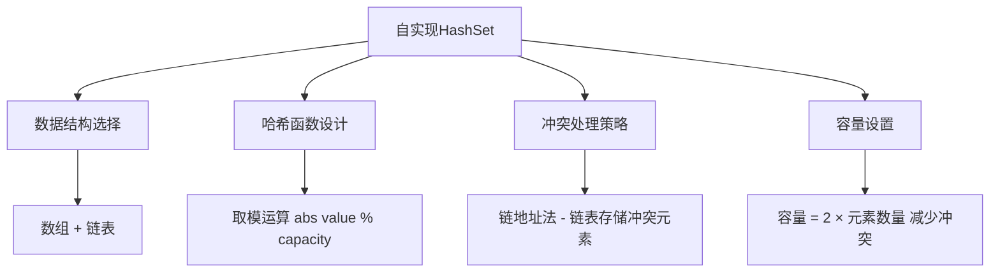

### 代码实现关键

```java
public boolean add(int value) {
    int index = hash(value);
    
    Node current = table[index];
    while (current != null) {
        if (current.value == value) {
            return false;
        }
        current = current.next;
    }
    
    Node newNode = new Node(value);
    newNode.next = table[index];
    table[index] = newNode;
    return true;
}
```

---

## 整数集合分解 - 快速排序原理

### 问题本质分析

整数集合分解的核心是**排序后分组**。要使两个子集和差最大，贪心策略是让一组包含最小元素，另一组包含最大元素。

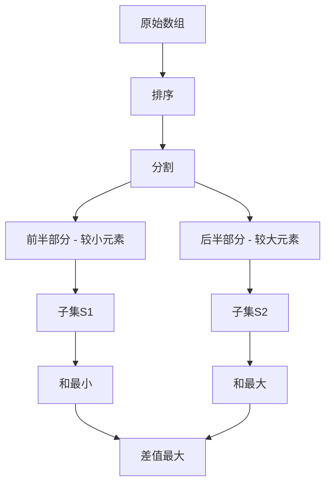

### 贪心策略正确性证明

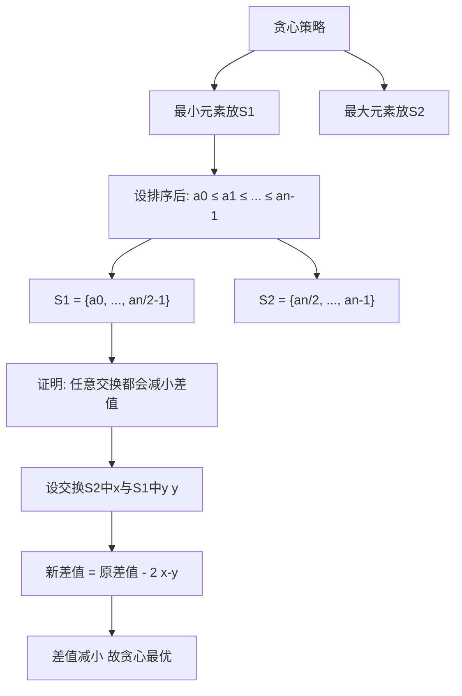

### 快速排序算法流程

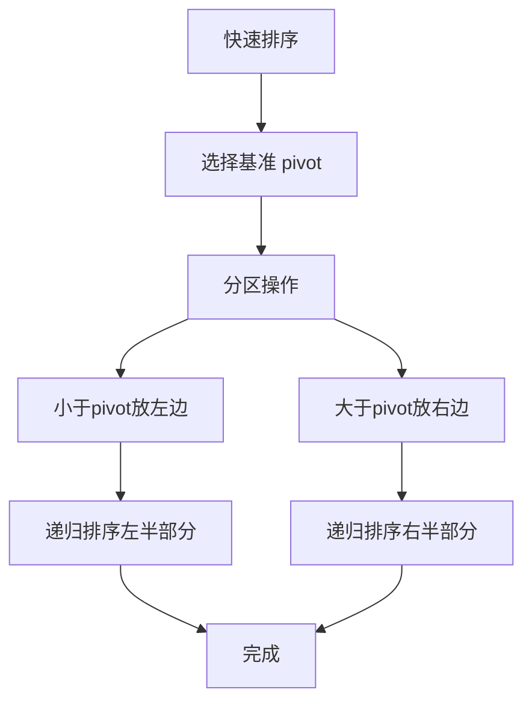

### 分区操作详解

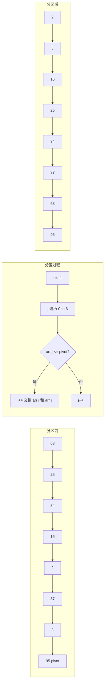

### 分区操作步骤分解

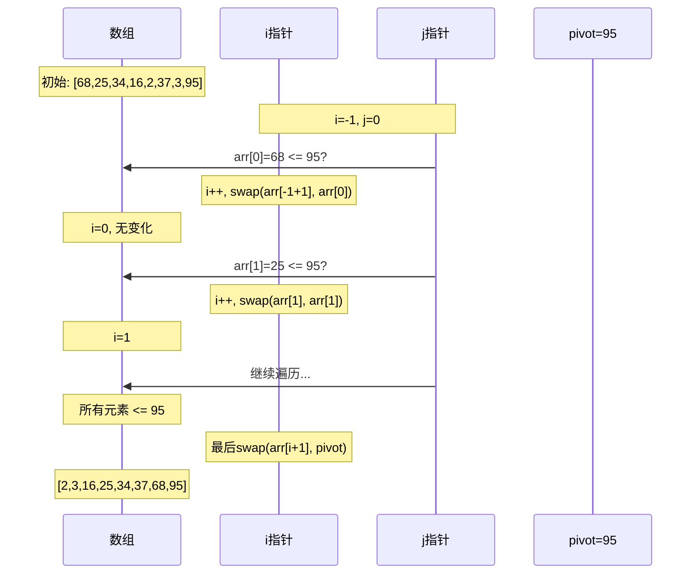

### 递归调用树

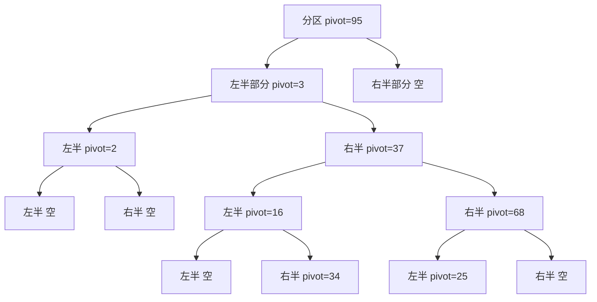

### 快速排序复杂度分析

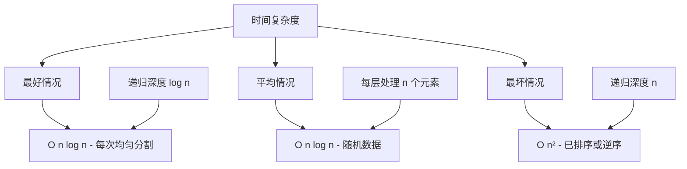

### 基准选择策略对比

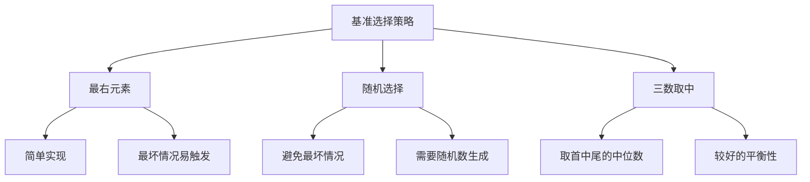

### 空间复杂度分析

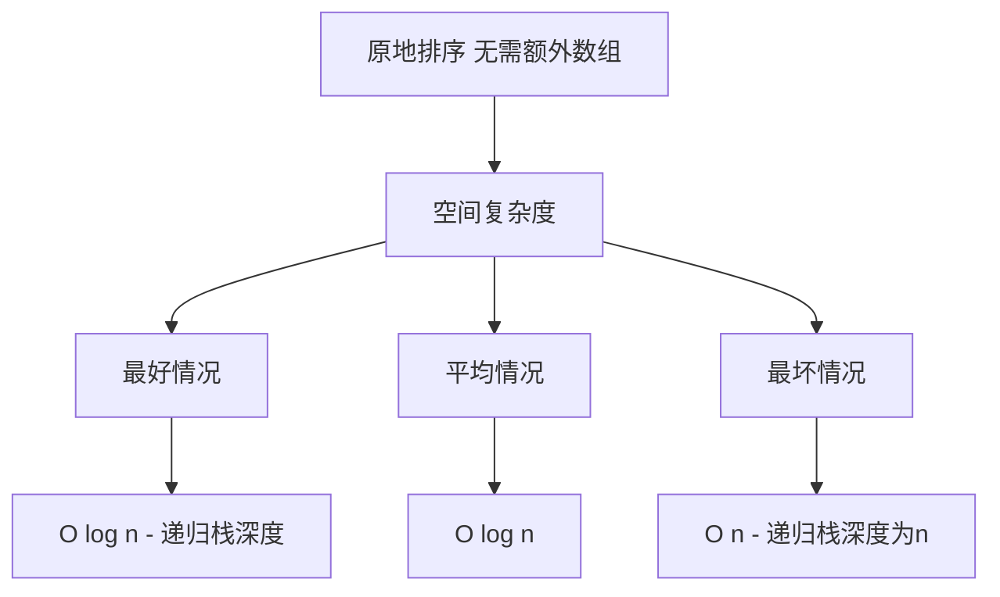

---

## 实验总结

### 算法对比

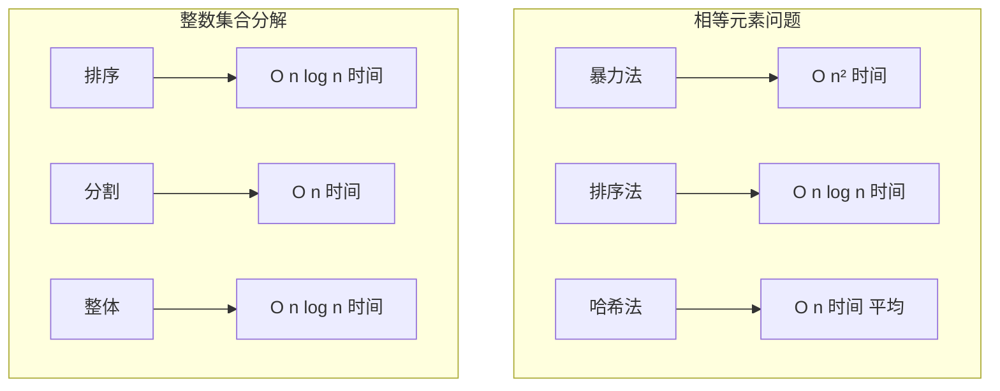

### 核心知识点

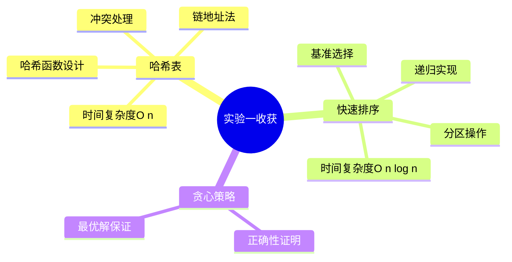

### 实现要点总结

| 问题 | 核心算法 | 关键实现 | 复杂度 |
|------|----------|----------|--------|
| 相等元素 | 自实现HashSet | 链地址法解决冲突 | O(n)平均 |
| 集合分解 | 自实现快速排序 | 分区+递归 | O(n log n) |

### 设计原则

1. **选择合适的数据结构** - 哈希表适合查找判重
2. **理解算法原理** - 快速排序的分区思想
3. **分析复杂度** - 评估时间和空间开销
4. **自实现的意义** - 深入理解底层原理

---

## 参考资料

1. 《算法导论》第11章 - 哈希表
2. 《算法导论》第7章 - 快速排序
3. 《数据结构与算法分析》- Mark Allen Weiss