# 实验二总结：递归算法设计与应用

***

## 目录

1. [格雷码问题 - 递归构造原理](#格雷码问题---递归构造原理)
2. [棋子移动游戏 - BFS状态空间搜索](#棋子移动游戏---bfs状态空间搜索)
3. [实验总结](#实验总结)

***

## 格雷码问题 - 递归构造原理

### 格雷码定义与性质

格雷码是一种特殊的二进制编码，具有以下性质：

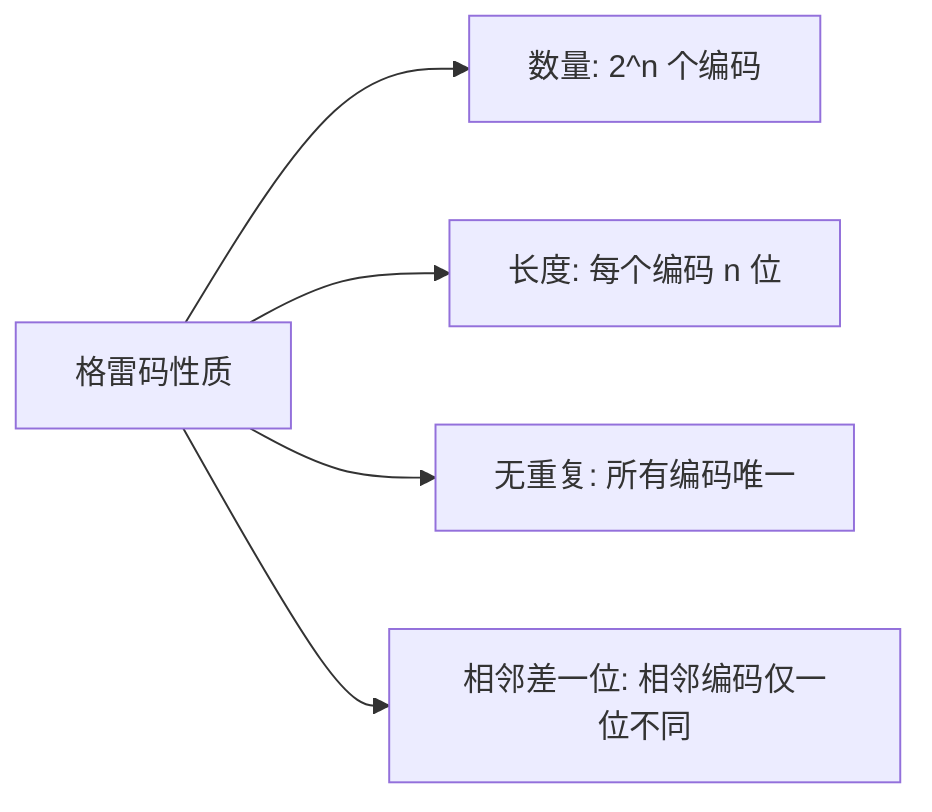

### 格雷码示例

```mermaid
flowchart TD
    subgraph n=1的格雷码
        A1["0"]
        A2["1"]
    end
    
    subgraph n=2的格雷码
        B1["00"]
        B2["01"]
        B3["11"]
        B4["10"]
    end
    
    subgraph n=3的格雷码
        C1["000"]
        C2["001"]
        C3["011"]
        C4["010"]
        C5["110"]
        C6["111"]
        C7["101"]
        C8["100"]
    end
    
    note1["相邻编码仅一位不同"] --> B1
    note2["00→01: 第2位变化"] --> B2
```

### 递归构造原理

n位格雷码可以由n-1位格雷码递归构造：

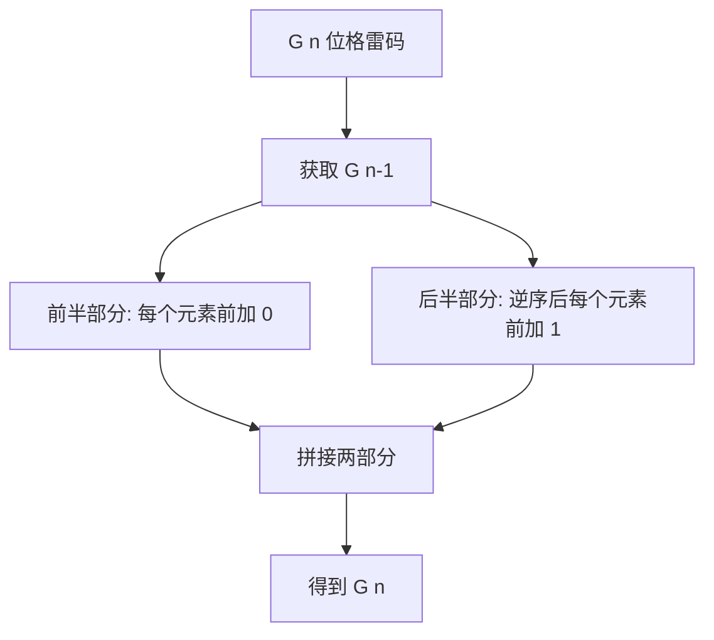

### 构造过程可视化

```mermaid
flowchart TD
    subgraph n=1
        A1["0"]
        A2["1"]
    end
    
    subgraph n=2
        B1["00 ← 0+0"]
        B2["01 ← 0+1"]
        B3["11 ← 1+1 逆序"]
        B4["10 ← 1+0 逆序"]
    end
    
    subgraph n=3
        C1["000"]
        C2["001"]
        C3["011"]
        C4["010"]
        C5["110 ← 逆序+1"]
        C6["111"]
        C7["101"]
        C8["100"]
    end
    
    A1 --> B1
    A2 --> B2
    A2 --> B3
    A1 --> B4
    
    B1 --> C1
    B2 --> C2
    B3 --> C3
    B4 --> C4
    B4 --> C5
    B3 --> C6
    B2 --> C7
    B1 --> C8
```

### 为什么相邻恰有一位不同？

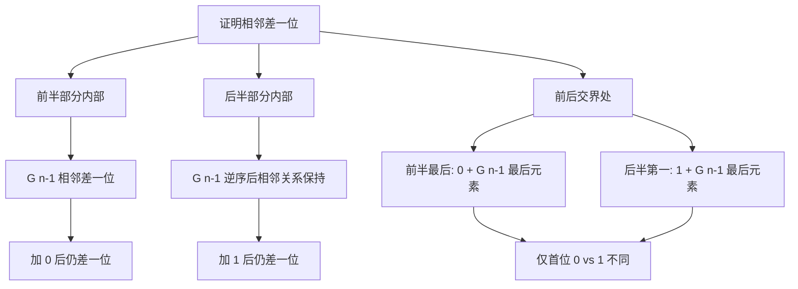

### 正确性证明详解

<br />

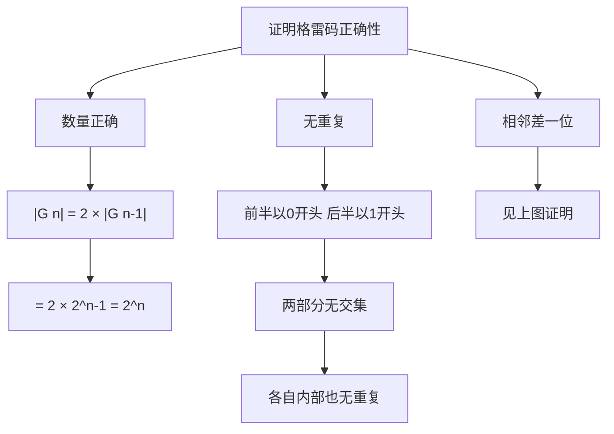

### 递归调用栈

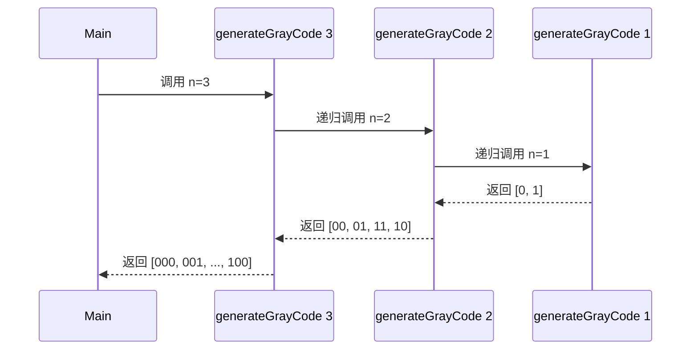

### 时间复杂度推导

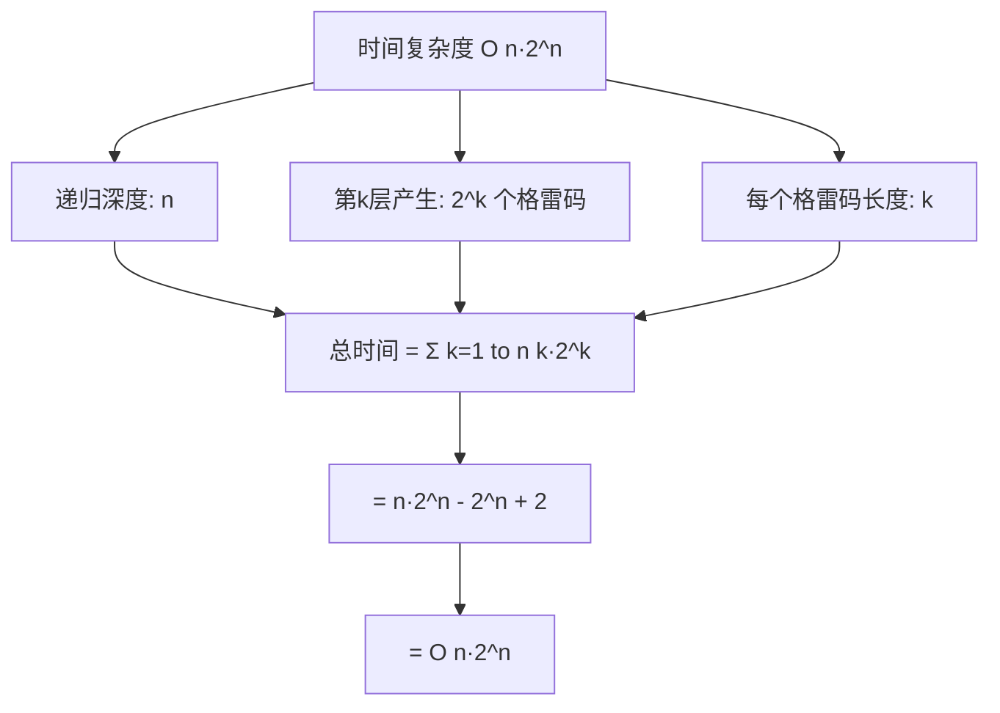

### 空间复杂度分析

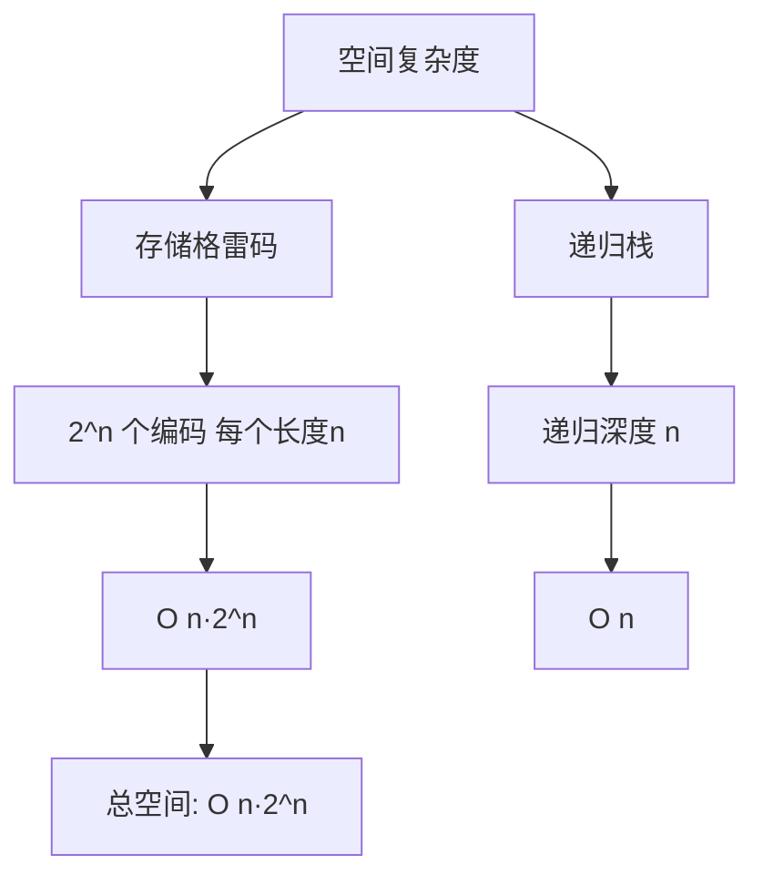

### 递归三要素

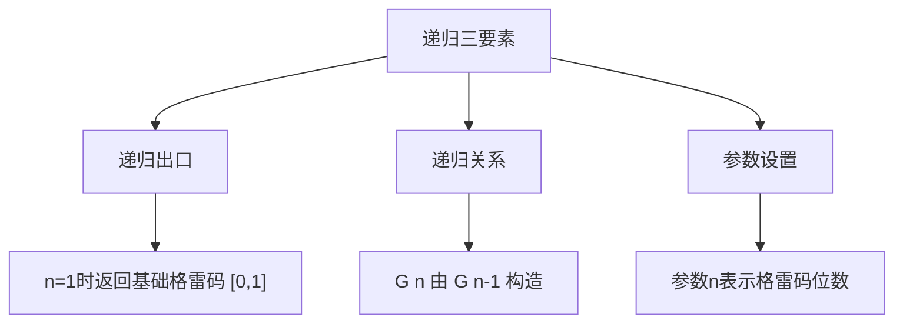

***

## 棋子移动游戏 - BFS状态空间搜索

### 问题建模

将棋子移动问题转化为状态空间搜索问题：

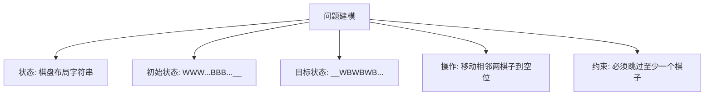

### 棋盘状态表示

```mermaid
flowchart LR
    subgraph 初始状态 n=4
        A[W] --> B[W] --> C[W] --> D[W] --> E[B] --> F[B] --> G[B] --> H[B] --> I[_] --> J[_]
    end
    
    subgraph 目标状态 n=4
        K[_] --> L[_] --> M[W] --> N[B] --> O[W] --> P[B] --> Q[W] --> R[B] --> S[W] --> T[B]
    end
    
    note1["位置: 0 1 2 3 4 5 6 7 8 9"] --> A
```

### 状态空间图

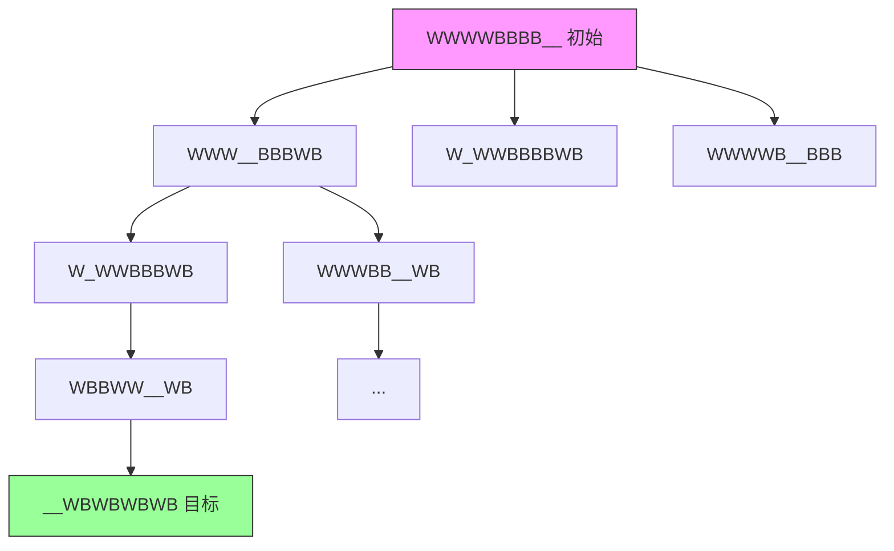

### BFS搜索流程

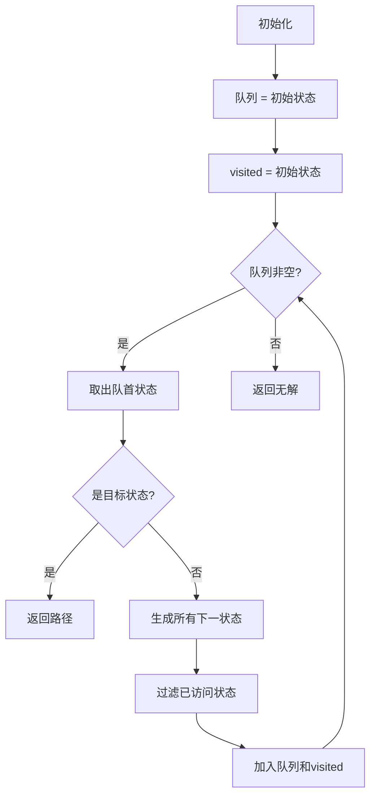

### BFS队列变化过程

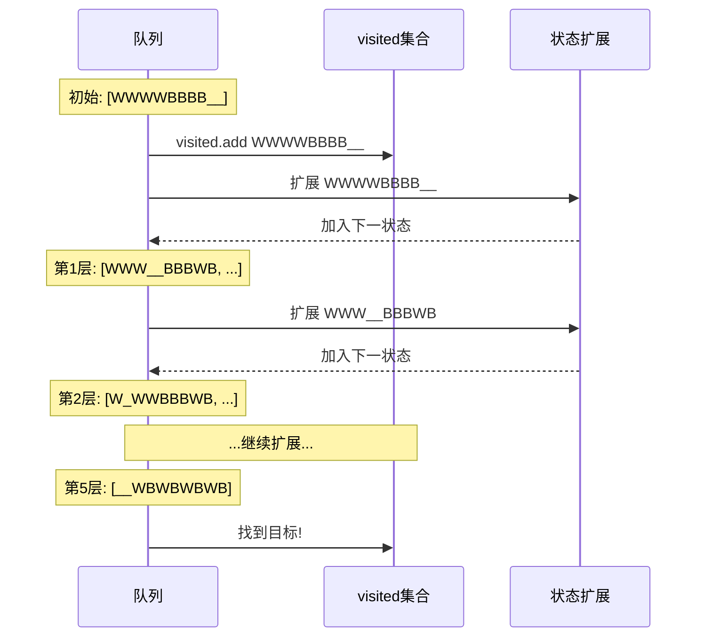

### BFS保证最短路径

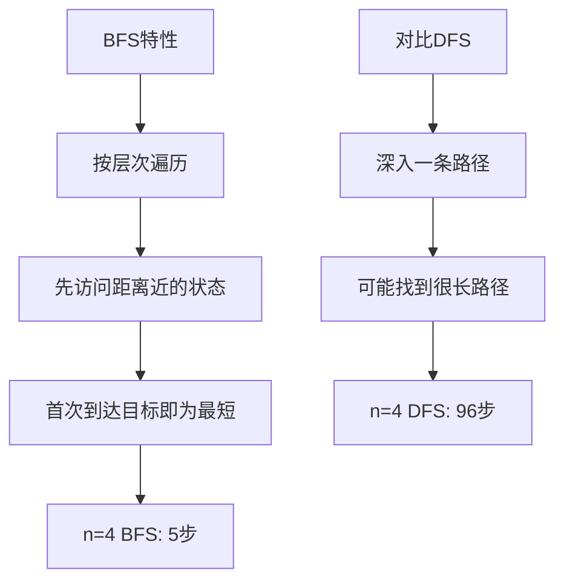

### 为什么BFS能找到最短路径？

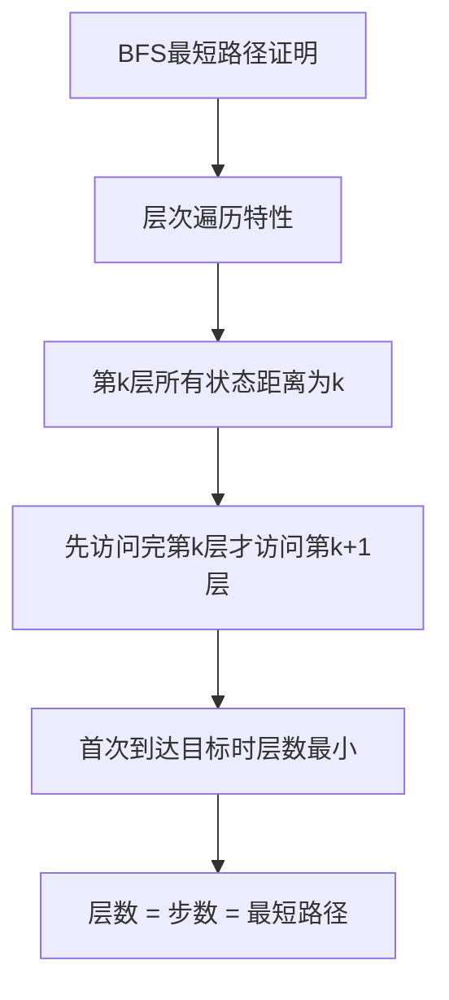

### 状态转移规则

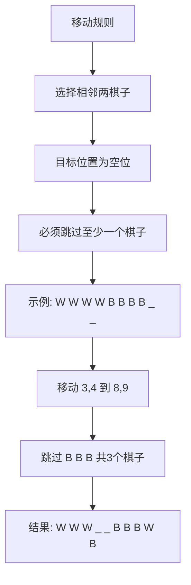

### 移动操作详解

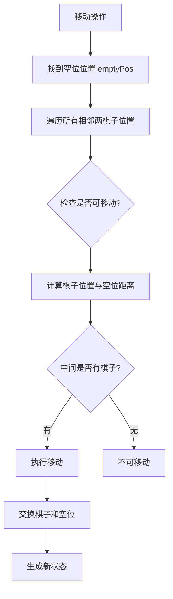

### 复杂度分析

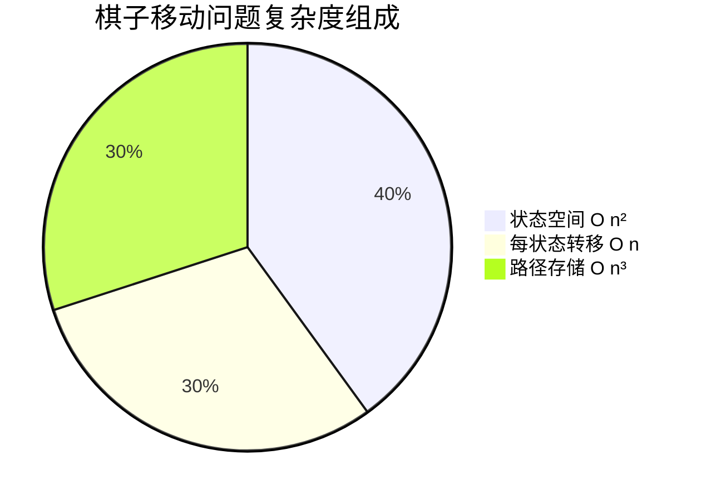

| 分析项    | 复杂度   | 说明              |
| ------ | ----- | --------------- |
| 状态空间大小 | O(n²) | C(2n+2, 2)种空位位置 |
| 每状态转移数 | O(n)  | 最多n种移动          |
| 时间复杂度  | O(n³) | 状态数×转移数         |
| 空间复杂度  | O(n³) | 存储所有状态          |

### 状态空间大小计算

```mermaid
flowchart TD
    A[状态空间大小] --> B[总位置数: 2n+2]
    B --> C[空位数量: 2]
    C --> D["状态数 = C 2n+2, 2"]
    D --> E["= 2n+2 × 2n+1 / 2"]
    E --> F["= O n²"]
```

### 最短步数规律

```mermaid
flowchart TD
    A[实验发现] --> B["n=4: 5步"]
    A --> C["n=5: 6步"]
    A --> D["n=6: 7步"]
    
    B --> E[推测规律]
    C --> E
    D --> E
    
    E --> F["最短步数 = n+1"]
```

***

## 实验总结

### 递归算法核心思想

```mermaid
flowchart TD
    A[递归算法] --> B[分解问题]
    B --> C[将大问题分解为小问题]
    C --> D[小问题与大问题结构相同]
    D --> E[递归解决小问题]
    E --> F[合并结果]
```

### BFS搜索核心思想

```mermaid
flowchart TD
    A[BFS搜索] --> B[状态空间建模]
    B --> C[定义状态表示]
    C --> D[定义状态转移]
    D --> E[使用队列遍历]
    E --> F[记录已访问状态]
    F --> G[找到最短路径]
```

### 算法对比

```mermaid
flowchart TD
    subgraph 格雷码问题
        A1[递归构造] --> B1["时间: O n·2^n"]
        A1 --> C1["空间: O n·2^n"]
        A1 --> D1[简洁优雅]
    end
    
    subgraph 棋子移动问题
        A2[BFS搜索] --> B2["时间: O n³"]
        A2 --> C2["空间: O n³"]
        A2 --> D2[保证最优解]
    end
```

### 核心知识点

```mermaid
mindmap
  root((实验二收获))
    递归思想
      递归关系
      递归出口
      参数设置
      复杂度分析
    状态空间搜索
      状态建模
      BFS队列
      去重优化
      最短路径
    算法选择
      DFS找任意解
      BFS找最短解
```

### 实现要点总结

| 问题   | 核心算法  | 关键实现      | 复杂度      |
| ---- | ----- | --------- | -------- |
| 格雷码  | 递归构造  | n位由n-1位构造 | O(n·2^n) |
| 棋子移动 | BFS搜索 | 队列+状态去重   | O(n³)    |

### 设计原则

1. **递归三要素** - 递归出口、递归关系、参数设置
2. **状态空间建模** - 合理的状态表示和转移规则
3. **搜索策略选择** - BFS适合找最短路径
4. **去重优化** - 避免重复访问同一状态

***

## 参考资料

1. 《算法导论》第4章 - 递归与分治
2. 《算法导论》第22章 - 图的基本算法 BFS
3. 《算法设计手册》- Steven S. Skiena

