# 实验三总结：分治算法设计与应用

---

## 目录

1. [分治算法基本原理](#分治算法基本原理)
2. [L型组件填图问题 - 分治策略详解](#l型组件填图问题---分治策略详解)
3. [第1~k小元素问题 - 快速选择算法](#第1k小元素问题---快速选择算法)
4. [实验总结](#实验总结)

---

## 分治算法基本原理

### 分治算法核心思想

将原问题分解成若干个相互独立且与原问题性质相同的子问题，用同样的方法解这些子问题并将这些子问题的解组合起来得到原问题的解。

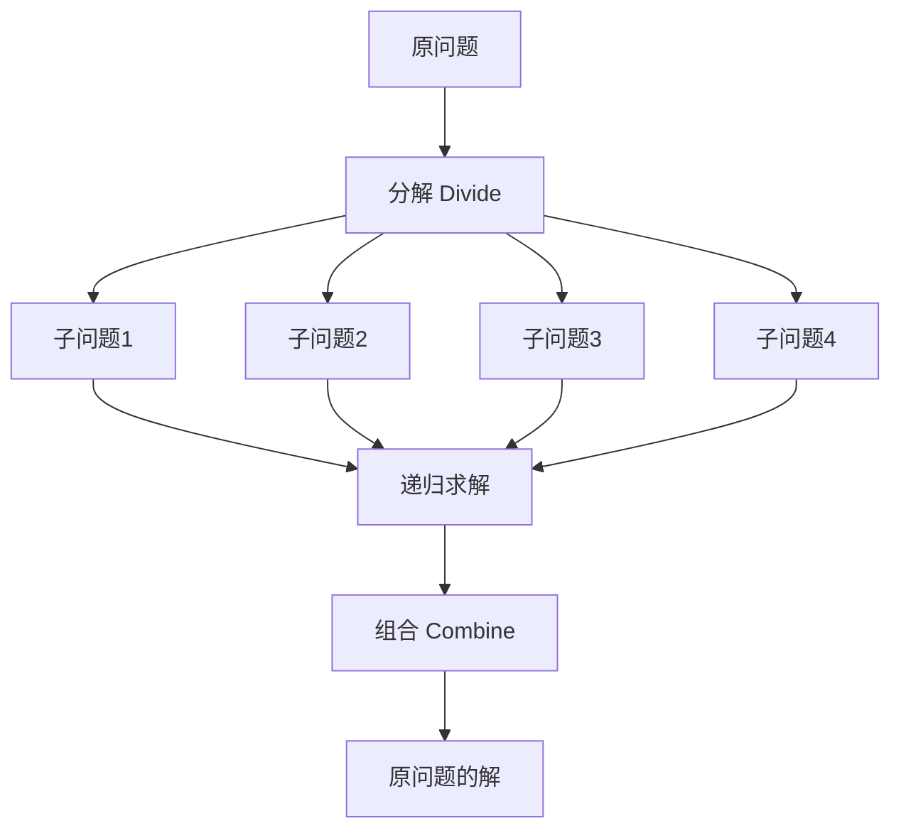
```mermaid
flowchart TD
    A[原问题] --> B[分解 Divide]
    B --> C[子问题1]
    B --> D[子问题2]
    B --> E[子问题3]
    B --> F[子问题4]
    
    C --> G[递归求解]
    D --> G
    E --> G
    F --> G
    
    G --> H[组合 Combine]
    H --> I[原问题的解]
```

### 分治算法的一般步骤

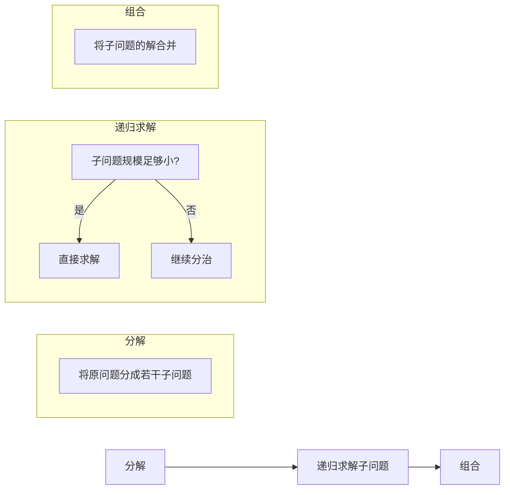
```mermaid
flowchart LR
    A[分解] --> B[递归求解子问题]
    B --> C[组合]
    
    subgraph 分解
        D[将原问题分成若干子问题]
    end
    
    subgraph 递归求解
        E[子问题规模足够小?]
        E -->|是| F[直接求解]
        E -->|否| G[继续分治]
    end
    
    subgraph 组合
        H[将子问题的解合并]
    end
```

### 分治算法适用条件

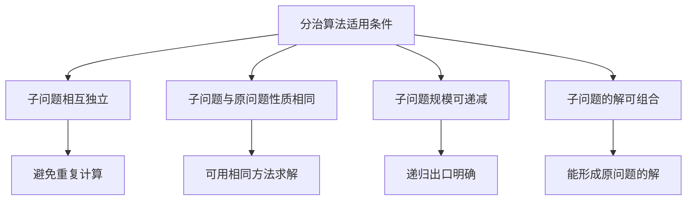
```mermaid
flowchart TD
    A[分治算法适用条件] --> B[子问题相互独立]
    A --> C[子问题与原问题性质相同]
    A --> D[子问题规模可递减]
    A --> E[子问题的解可组合]
    
    B --> F[避免重复计算]
    C --> G[可用相同方法求解]
    D --> H[递归出口明确]
    E --> I[能形成原问题的解]
```

---

## L型组件填图问题 - 分治策略详解

### 问题本质分析

L型组件填图问题的核心是**棋盘覆盖**。需要用L型条块覆盖除特殊方格外的所有方格。

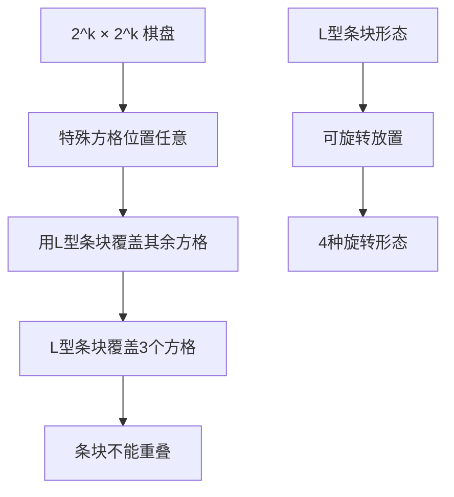
```mermaid
flowchart TD
    A[2^k × 2^k 棋盘] --> B[特殊方格位置任意]
    B --> C[用L型条块覆盖其余方格]
    C --> D[L型条块覆盖3个方格]
    D --> E[条块不能重叠]
    
    F[L型条块形态] --> G[可旋转放置]
    G --> H[4种旋转形态]
```

### 分治策略设计

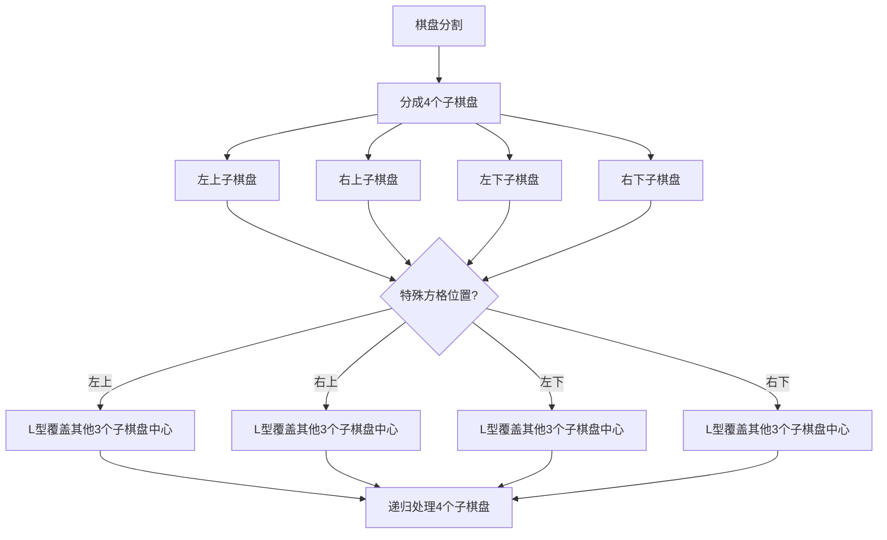
```mermaid
flowchart TD
    A[棋盘分割] --> B[分成4个子棋盘]
    B --> C[左上子棋盘]
    B --> D[右上子棋盘]
    B --> E[左下子棋盘]
    B --> F[右下子棋盘]
    
    C --> G{特殊方格位置?}
    D --> G
    E --> G
    F --> G
    
    G -->|左上| H[L型覆盖其他3个子棋盘中心]
    G -->|右上| I[L型覆盖其他3个子棋盘中心]
    G -->|左下| J[L型覆盖其他3个子棋盘中心]
    G -->|右下| K[L型覆盖其他3个子棋盘中心]
    
    H --> L[递归处理4个子棋盘]
    I --> L
    J --> L
    K --> L
```

### L型条块覆盖原理

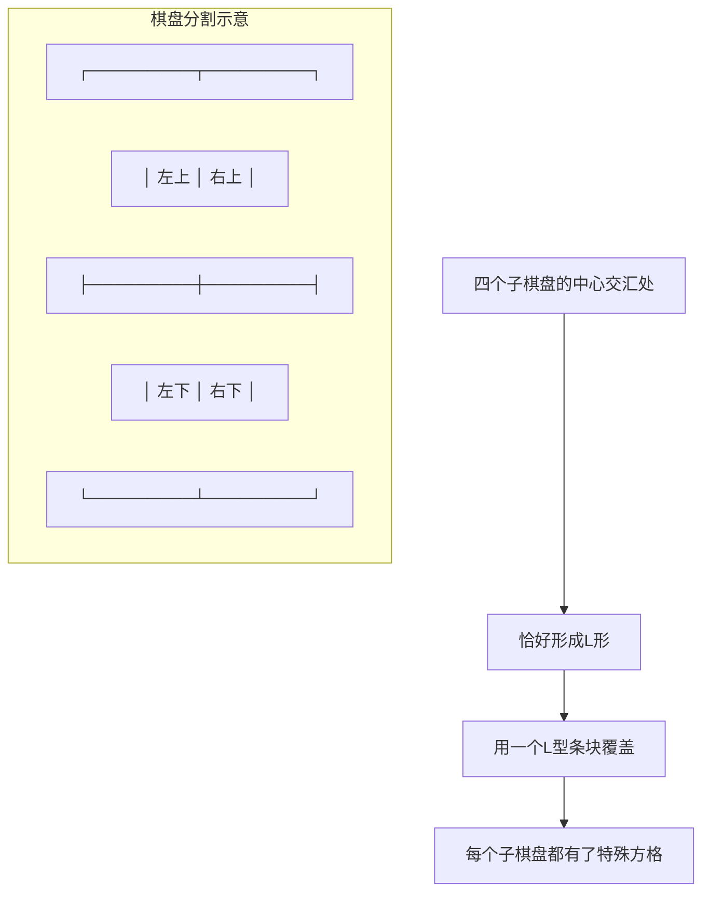
```mermaid
flowchart TD
    subgraph 棋盘分割示意
        A["┌─────────┬─────────┐"]
        B["│ 左上    │ 右上    │"]
        C["├─────────┼─────────┤"]
        D["│ 左下    │ 右下    │"]
        E["└─────────┴─────────┘"]
    end
    
    F[四个子棋盘的中心交汇处] --> G[恰好形成L形]
    G --> H[用一个L型条块覆盖]
    H --> I[每个子棋盘都有了特殊方格]
```

### 四种覆盖情况详解

```mermaid
flowchart TD
    subgraph 特殊方格在左上
        A1["┌───┬───┐"] --> B1["│ S │ 1 │"]
        B1 --> C1["├───┼───┤"]
        C1 --> D1["│ 1 │ 1 │"]
        D1 --> E1["└───┴───┘"]
        F1[L型覆盖右上左下右下中心]
    end
    
    subgraph 特殊方格在右上
        A2["┌───┬───┐"] --> B2["│ 1 │ S │"]
        B2 --> C2["├───┼───┤"]
        C2 --> D2["│ 1 │ 1 │"]
        D2 --> E2["└───┴───┘"]
        F2[L型覆盖左上左下右下中心]
    end
    
    subgraph 特殊方格在左下
        A3["┌───┬───┐"] --> B3["│ 1 │ 1 │"]
        B3 --> C3["├───┼───┤"]
        C3 --> D3["│ S │ 1 │"]
        D3 --> E3["└───┴───┘"]
        F3[L型覆盖左上右上右下中心]
    end
    
    subgraph 特殊方格在右下
        A4["┌───┬───┐"] --> B4["│ 1 │ 1 │"]
        B4 --> C4["├───┼───┤"]
        C4 --> D4["│ 1 │ S │"]
        D4 --> E4["└───┴───┘"]
        F4[L型覆盖左上右上左下中心]
    end
```

### 递归调用树

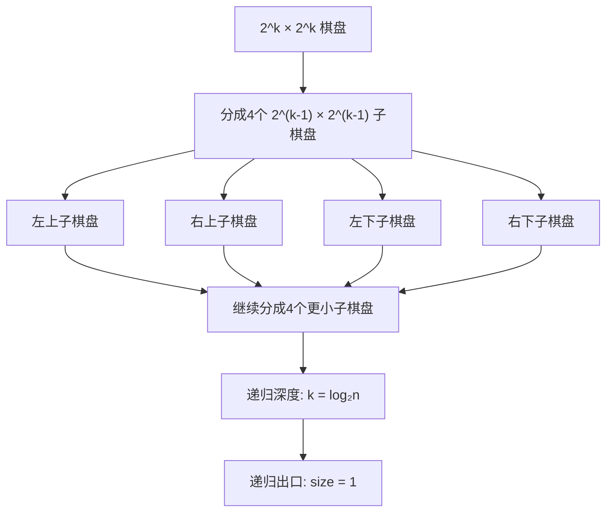
```mermaid
flowchart TD
    A["2^k × 2^k 棋盘"] --> B["分成4个 2^(k-1) × 2^(k-1) 子棋盘"]
    
    B --> C["左上子棋盘"]
    B --> D["右上子棋盘"]
    B --> E["左下子棋盘"]
    B --> F["右下子棋盘"]
    
    C --> G["继续分成4个更小子棋盘"]
    D --> G
    E --> G
    F --> G
    
    G --> H["递归深度: k = log₂n"]
    H --> I["递归出口: size = 1"]
```

### 时间复杂度分析

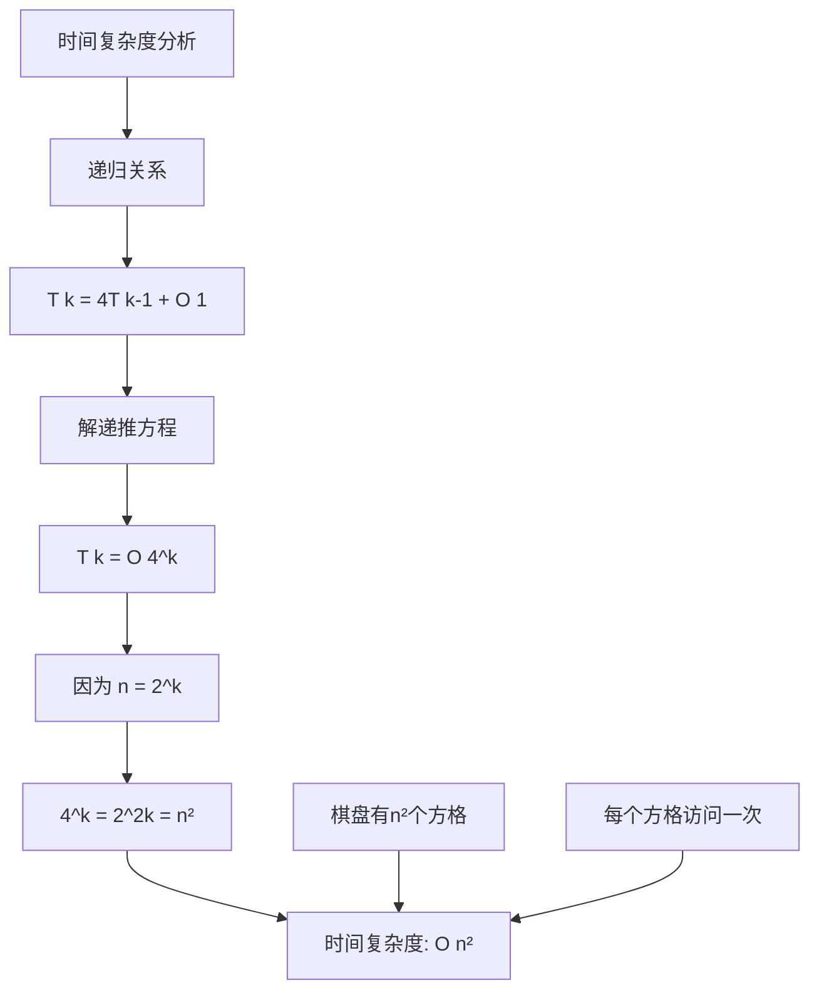
```mermaid
flowchart TD
    A[时间复杂度分析] --> B[递归关系]
    B --> C["T k = 4T k-1 + O 1"]
    
    C --> D[解递推方程]
    D --> E["T k = O 4^k"]
    
    E --> F["因为 n = 2^k"]
    F --> G["4^k = 2^2k = n²"]
    
    G --> H["时间复杂度: O n²"]
    
    note1["棋盘有n²个方格"] --> H
    note2["每个方格访问一次"] --> H
```

### L型条块数量计算

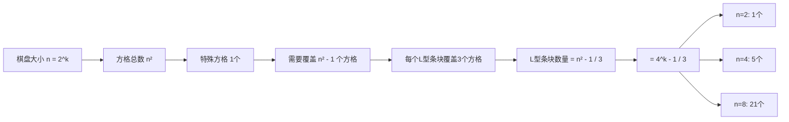
```mermaid
flowchart LR
    A[棋盘大小 n = 2^k] --> B[方格总数 n²]
    B --> C[特殊方格 1个]
    C --> D[需要覆盖 n² - 1 个方格]
    
    D --> E[每个L型条块覆盖3个方格]
    E --> F["L型条块数量 = n² - 1 / 3"]
    
    F --> G["= 4^k - 1 / 3"]
    
    G --> H["n=2: 1个"]
    G --> I["n=4: 5个"]
    G --> J["n=8: 21个"]
```

### 空间复杂度分析

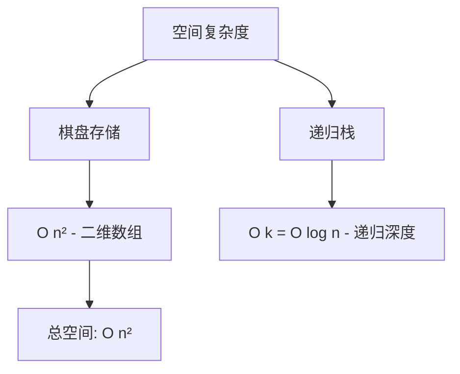
```mermaid
flowchart TD
    A[空间复杂度] --> B[棋盘存储]
    A --> C[递归栈]
    
    B --> D["O n² - 二维数组"]
    C --> E["O k = O log n - 递归深度"]
    
    D --> F["总空间: O n²"]
```

---

## 第1~k小元素问题 - 快速选择算法

### 问题本质分析

第1~k小元素问题的核心是**选择问题**。需要在O(n)时间内找到前k个最小元素。

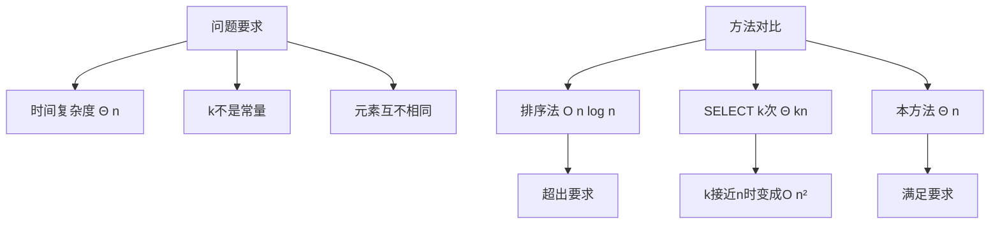
```mermaid
flowchart TD
    A[问题要求] --> B[时间复杂度 Θ n]
    A --> C[k不是常量]
    A --> D[元素互不相同]
    
    E[方法对比] --> F[排序法 O n log n]
    E --> G[SELECT k次 Θ kn]
    E --> H[本方法 Θ n]
    
    F --> I[超出要求]
    G --> J[k接近n时变成O n²]
    H --> K[满足要求]
```

### 快速选择算法原理

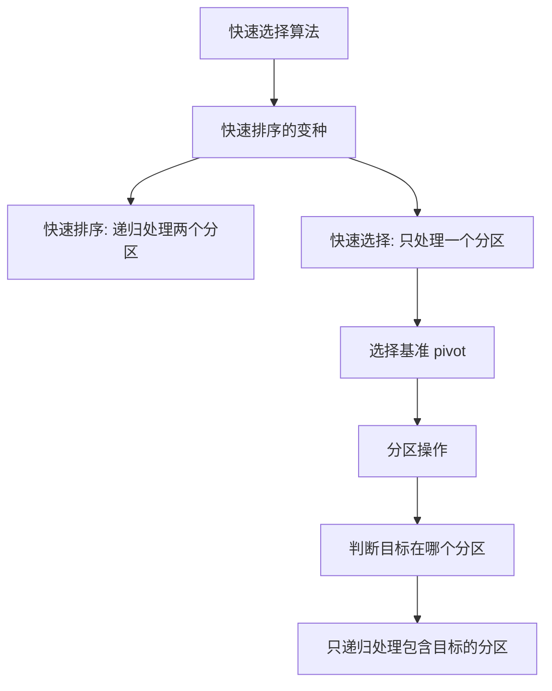
```mermaid
flowchart TD
    A[快速选择算法] --> B[快速排序的变种]
    
    B --> C[快速排序: 递归处理两个分区]
    B --> D[快速选择: 只处理一个分区]
    
    D --> E[选择基准 pivot]
    E --> F[分区操作]
    F --> G[判断目标在哪个分区]
    G --> H[只递归处理包含目标的分区]
```

### 分区操作详解

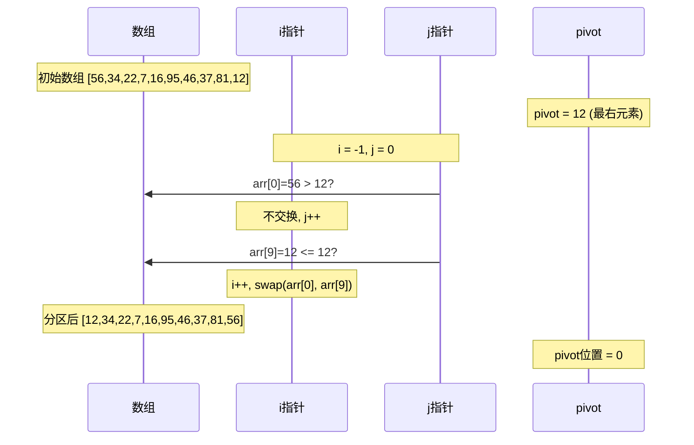
```mermaid
sequenceDiagram
    participant Arr as 数组
    participant i as i指针
    participant j as j指针
    participant Pivot as pivot
    
    Note over Arr: 初始数组 [56,34,22,7,16,95,46,37,81,12]
    Note over Pivot: pivot = 12 (最右元素)
    Note over i,j: i = -1, j = 0
    
    j->>Arr: arr[0]=56 > 12?
    Note over i: 不交换, j++
    
    j->>Arr: arr[9]=12 <= 12?
    Note over i: i++, swap(arr[0], arr[9])
    
    Note over Arr: 分区后 [12,34,22,7,16,95,46,37,81,56]
    Note over Pivot: pivot位置 = 0
```

### 递归选择过程

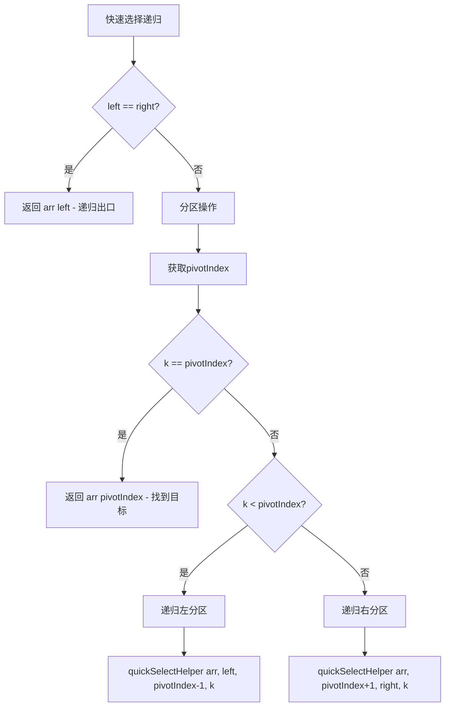
```mermaid
flowchart TD
    A[快速选择递归] --> B{left == right?}
    B -->|是| C[返回 arr left - 递归出口]
    B -->|否| D[分区操作]
    
    D --> E[获取pivotIndex]
    E --> F{k == pivotIndex?}
    
    F -->|是| G[返回 arr pivotIndex - 找到目标]
    F -->|否| H{k < pivotIndex?}
    
    H -->|是| I[递归左分区]
    H -->|否| J[递归右分区]
    
    I --> K["quickSelectHelper arr, left, pivotIndex-1, k"]
    J --> L["quickSelectHelper arr, pivotIndex+1, right, k"]
```

### 时间复杂度分析

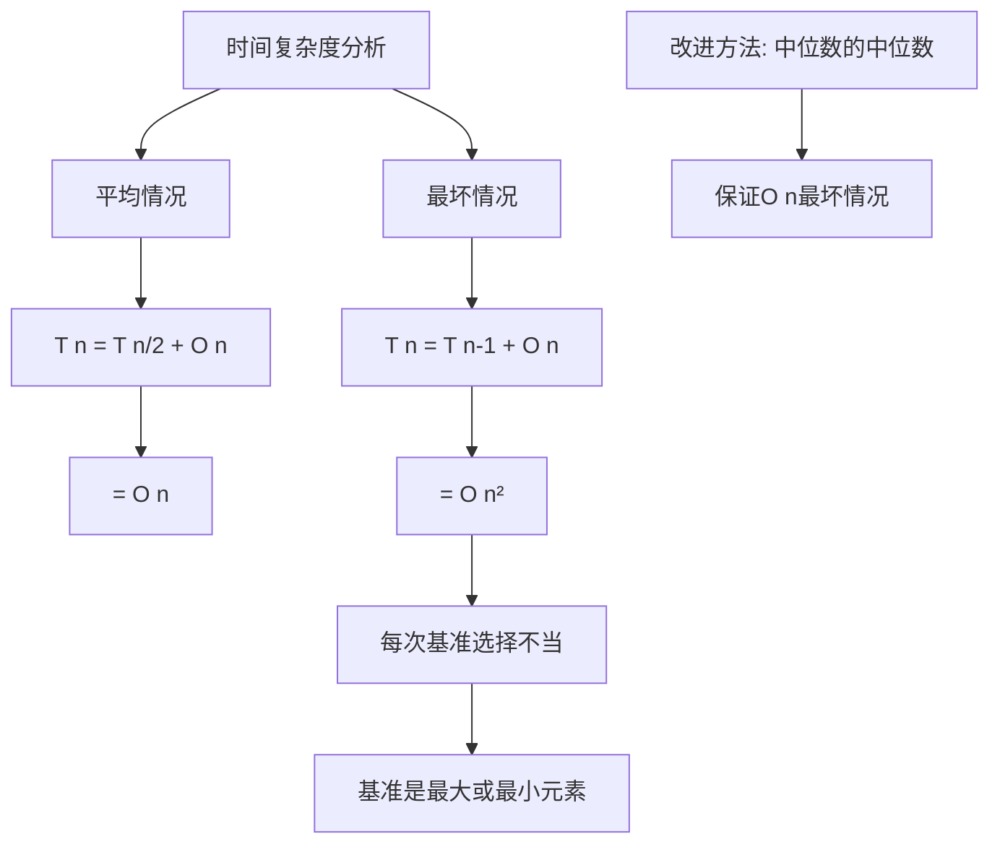
```mermaid
flowchart TD
    A[时间复杂度分析] --> B[平均情况]
    A --> C[最坏情况]
    
    B --> D["T n = T n/2 + O n"]
    D --> E["= O n"]
    
    C --> F["T n = T n-1 + O n"]
    F --> G["= O n²"]
    
    G --> H[每次基准选择不当]
    H --> I[基准是最大或最小元素]
    
    note1["改进方法: 中位数的中位数"] --> J[保证O n最坏情况]
```

### 改进的SELECT算法

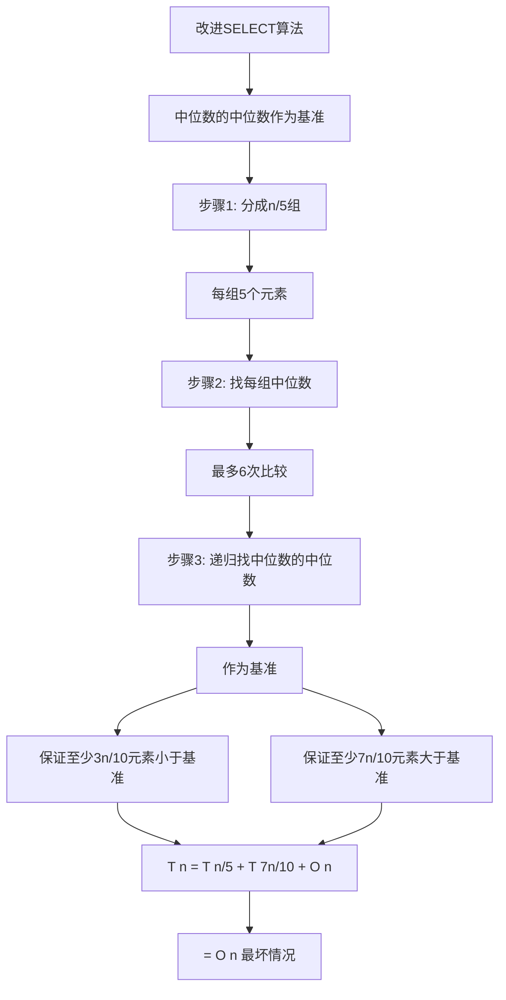
```mermaid
flowchart TD
    A[改进SELECT算法] --> B[中位数的中位数作为基准]
    
    B --> C[步骤1: 分成n/5组]
    C --> D[每组5个元素]
    
    D --> E[步骤2: 找每组中位数]
    E --> F[最多6次比较]
    
    F --> G[步骤3: 递归找中位数的中位数]
    G --> H[作为基准]
    
    H --> I[保证至少3n/10元素小于基准]
    H --> J[保证至少7n/10元素大于基准]
    
    I --> K["T n = T n/5 + T 7n/10 + O n"]
    J --> K
    K --> L["= O n 最坏情况"]
```

### 为什么选择每组5个元素？

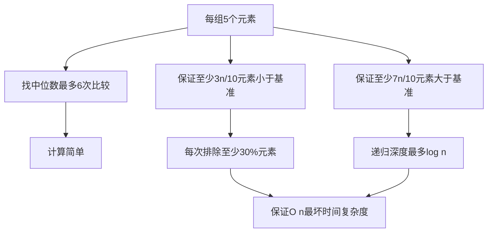
```mermaid
flowchart TD
    A[每组5个元素] --> B[找中位数最多6次比较]
    A --> C[保证至少3n/10元素小于基准]
    A --> D[保证至少7n/10元素大于基准]
    
    B --> E[计算简单]
    C --> F[每次排除至少30%元素]
    D --> G[递归深度最多log n]
    
    F --> H[保证O n最坏时间复杂度]
    G --> H
```

### 前1~k小元素收集策略

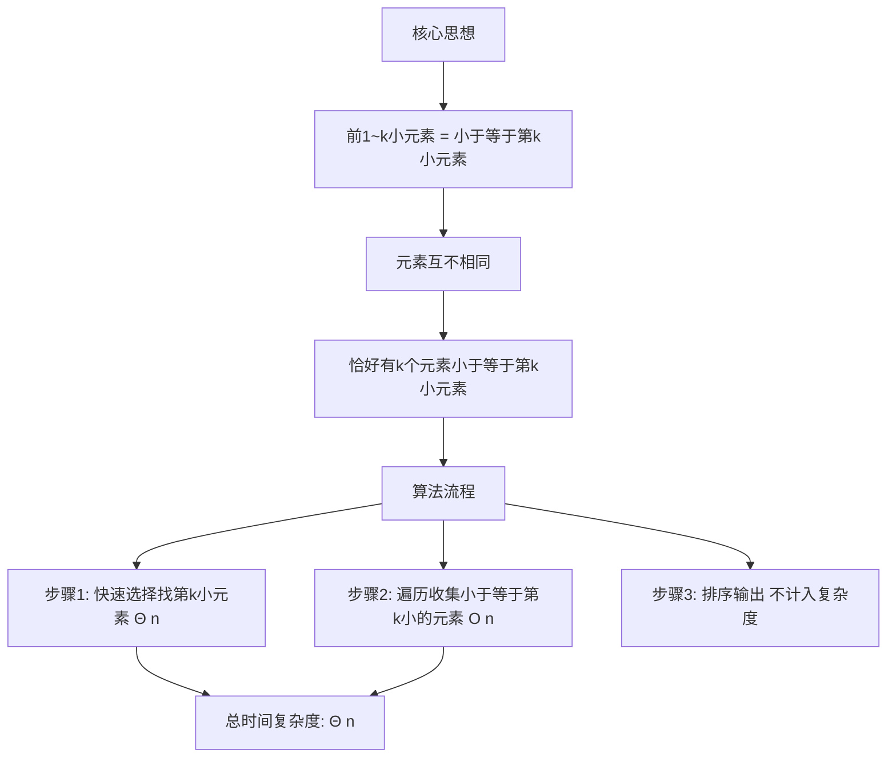
```mermaid
flowchart TD
    A[核心思想] --> B["前1~k小元素 = 小于等于第k小元素"]
    
    B --> C[元素互不相同]
    C --> D[恰好有k个元素小于等于第k小元素]
    
    D --> E[算法流程]
    E --> F[步骤1: 快速选择找第k小元素 Θ n]
    E --> G[步骤2: 遍历收集小于等于第k小的元素 O n]
    E --> H[步骤3: 排序输出 不计入复杂度]
    
    F --> I["总时间复杂度: Θ n"]
    G --> I
```

### 算法对比

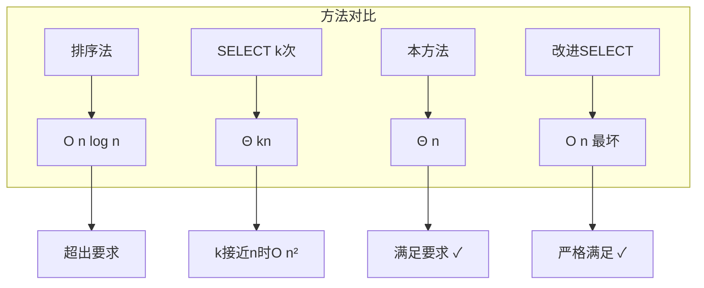
```mermaid
graph TD
    subgraph 方法对比
        A[排序法] --> B["O n log n"]
        C["SELECT k次"] --> D["Θ kn"]
        E[本方法] --> F["Θ n"]
        G[改进SELECT] --> H["O n 最坏"]
    end
    
    B --> I[超出要求]
    D --> J["k接近n时O n²"]
    F --> K[满足要求 ✓]
    H --> L[严格满足 ✓]
```

---

## 实验总结

### 分治算法设计要点

```mermaid
mindmap
  root((分治算法))
    分解
      确定分割方式
      子问题规模
      子问题数量
    递归求解
      递归出口
      递归关系
      参数设置
    组合
      子问题解合并
      组合方式
      组合复杂度
```

### 两个问题的分治策略对比

```mermaid
flowchart TD
    subgraph L型填图
        A1[4路分治] --> B1[分成4个子棋盘]
        B1 --> C1[每个子棋盘独立处理]
        C1 --> D1[直接组合]
    end
    
    subgraph 第k小元素
        A2[2路分治] --> B2[分成2个分区]
        B2 --> C2[只处理一个分区]
        C2 --> D2[遍历收集组合]
    end
```

### 算法复杂度对比

| 问题 | 分治策略 | 时间复杂度 | 空间复杂度 | 递归深度 |
|------|----------|------------|------------|----------|
| L型填图 | 4路分治 | O(n²) | O(n²) | O(log n) |
| 第k小元素 | 2路分治 | Θ(n) | O(n) | O(log n) |

### 核心知识点

```mermaid
mindmap
  root((实验三收获))
    分治思想
      分解策略
      递归求解
      组合方式
    L型填图
      棋盘分割
      L型覆盖
      递归填充
    快速选择
      分区操作
      基准选择
      时间复杂度
    改进算法
      中位数的中位数
      最坏情况优化
```

### 设计原则总结

1. **分解策略选择**：
   - L型填图：4路分治，每个子问题规模减半
   - 快速选择：2路分治，只处理一个分区

2. **递归出口设计**：
   - L型填图：棋盘大小为1
   - 快速选择：数组只有一个元素

3. **组合方式选择**：
   - L型填图：直接组合，无需额外处理
   - 快速选择：遍历收集，需要额外处理

4. **复杂度分析**：
   - 建立递推方程
   - 解递推方程
   - 考虑最坏情况

### 实现要点

| 要点 | L型填图 | 快速选择 |
|------|---------|----------|
| 分解方式 | 按位置分成4块 | 按值分成2区 |
| 处理方式 | 全部递归 | 选择性递归 |
| 组合方式 | 无需组合 | 需要收集 |
| 优化方向 | 无需优化 | 基准选择优化 |

---

## 参考资料

1. 《算法导论》第4章 - 分治策略
2. 《算法导论》第9章 - 中位数和顺序统计量
3. 《数据结构与算法分析》- Mark Allen Weiss