# 算法拓展与方法论

---

## 目录

1. [哈希表进阶：开放地址法](#哈希表进阶开放地址法)
2. [排序算法对比与优化](#排序算法对比与优化)
3. [递归与分治策略](#递归与分治策略)
4. [搜索算法：DFS vs BFS](#搜索算法dfs-vs-bfs)
5. [算法复杂度总结](#算法复杂度总结)
6. [算法设计方法论](#算法设计方法论)

---

## 哈希表进阶：开放地址法

除了链地址法，另一种解决哈希冲突的方法是**开放地址法**。

### 开放地址法类型

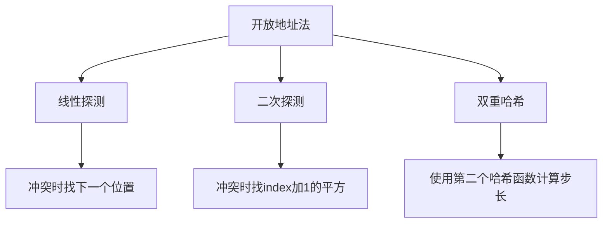

### 线性探测示例

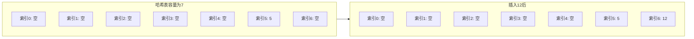

### 二次探测示例

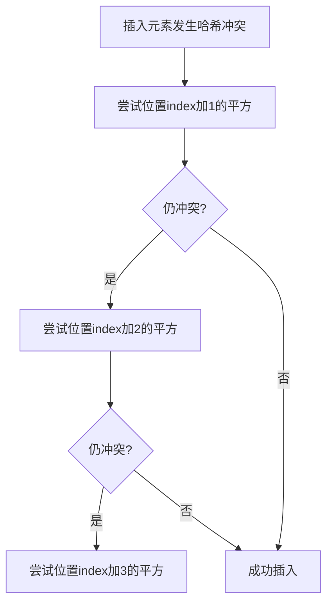

### 双重哈希

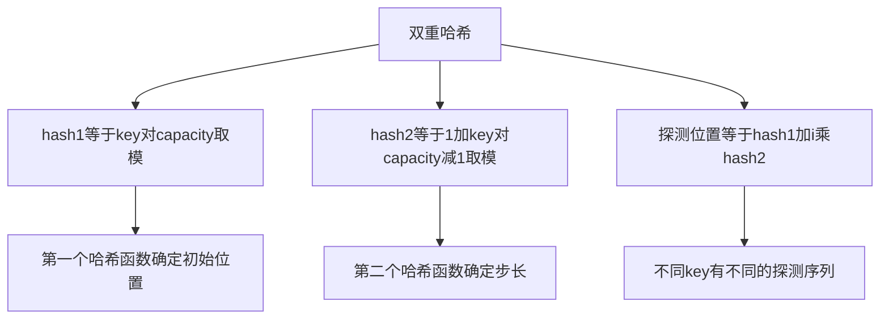

### 链地址法 vs 开放地址法

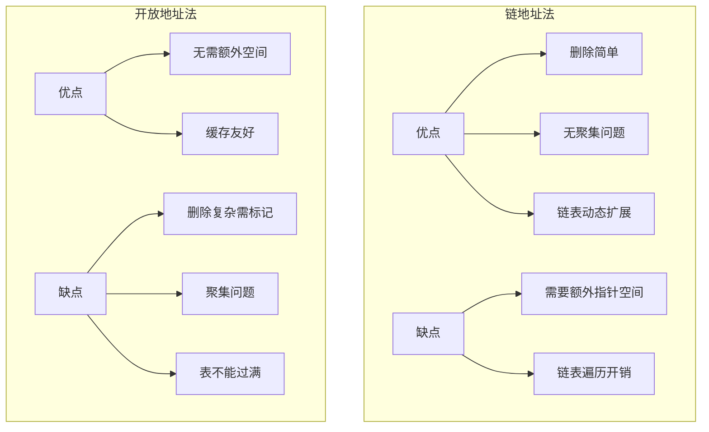

### 聚集问题

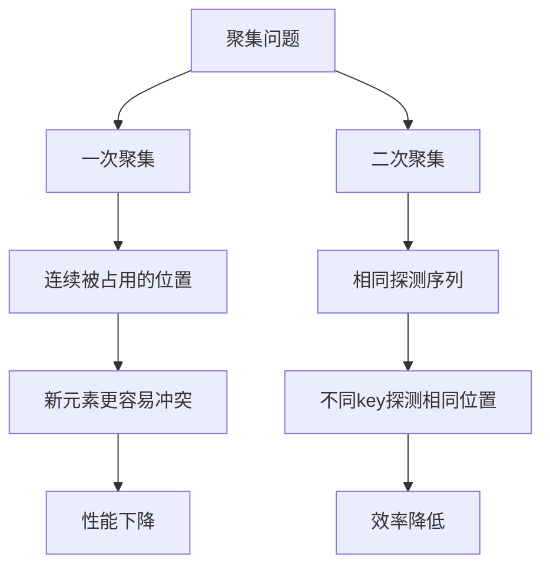

---

## 排序算法对比与优化

### 主要排序算法对比

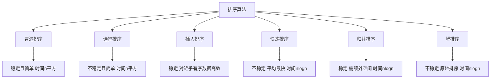

### 排序算法复杂度对比表

| 算法 | 平均时间 | 最坏时间 | 空间 | 稳定性 |
|------|----------|----------|------|--------|
| 冒泡排序 | O(n²) | O(n²) | O(1) | 稳定 |
| 选择排序 | O(n²) | O(n²) | O(1) | 不稳定 |
| 插入排序 | O(n²) | O(n²) | O(1) | 稳定 |
| 快速排序 | O(n log n) | O(n²) | O(log n) | 不稳定 |
| 归并排序 | O(n log n) | O(n log n) | O(n) | 稳定 |
| 堆排序 | O(n log n) | O(n log n) | O(1) | 不稳定 |

### 快速排序优化策略

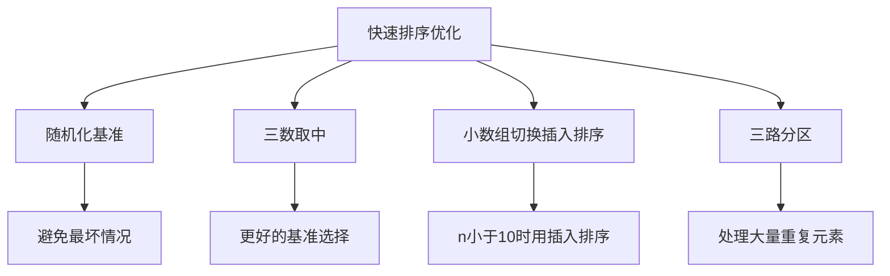

### 三数取中选择基准

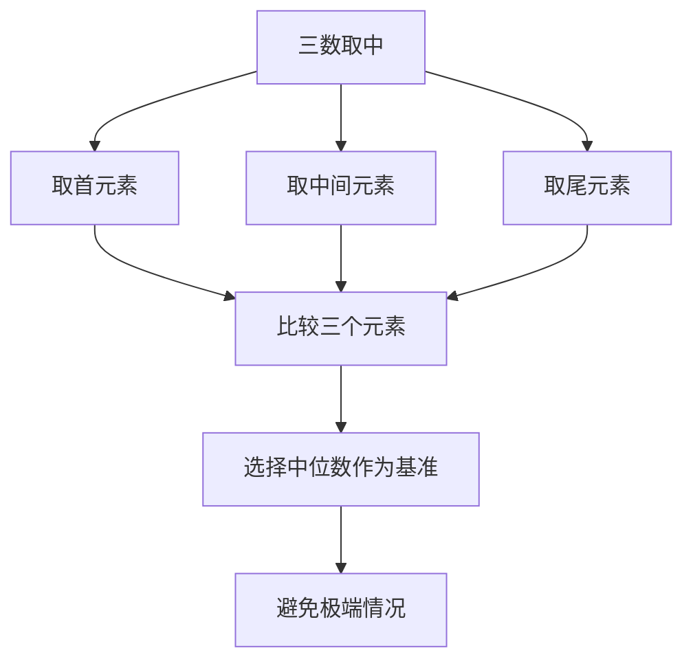

### 三路快排处理重复元素

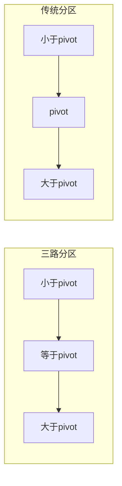

### 三路快排流程

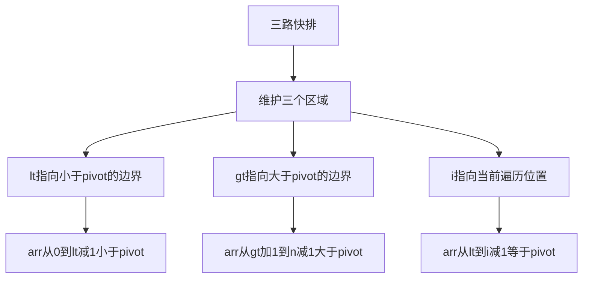

### 排序算法选择指南

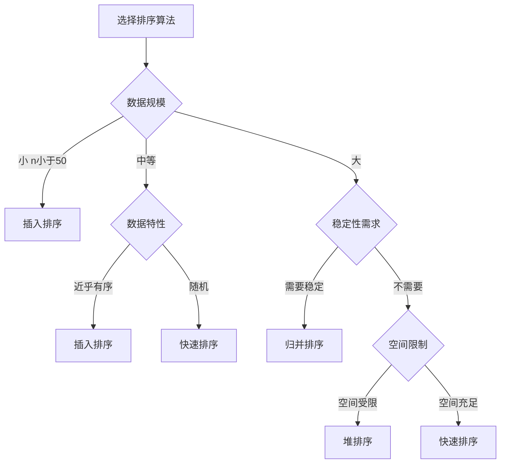

---

## 递归与分治策略

### 分治算法框架

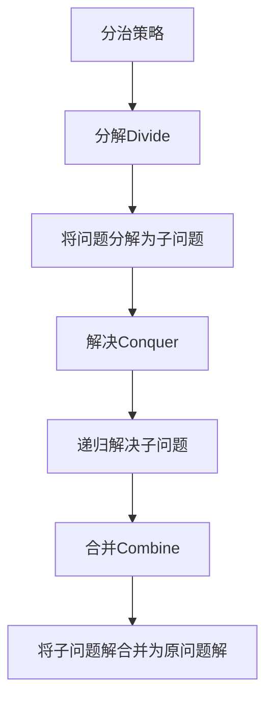

### 分治算法模板

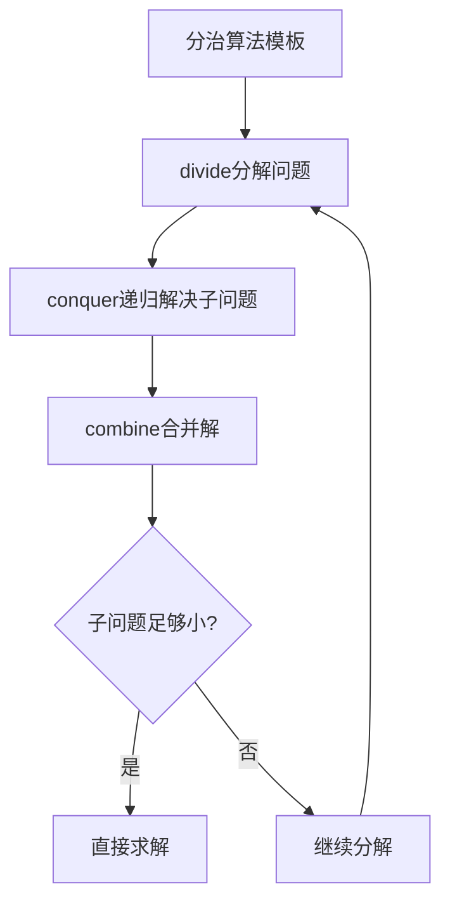

### 经典分治问题

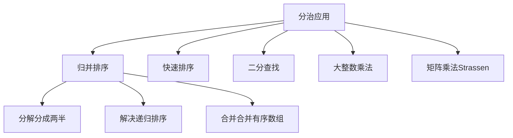

### 归并排序分治过程

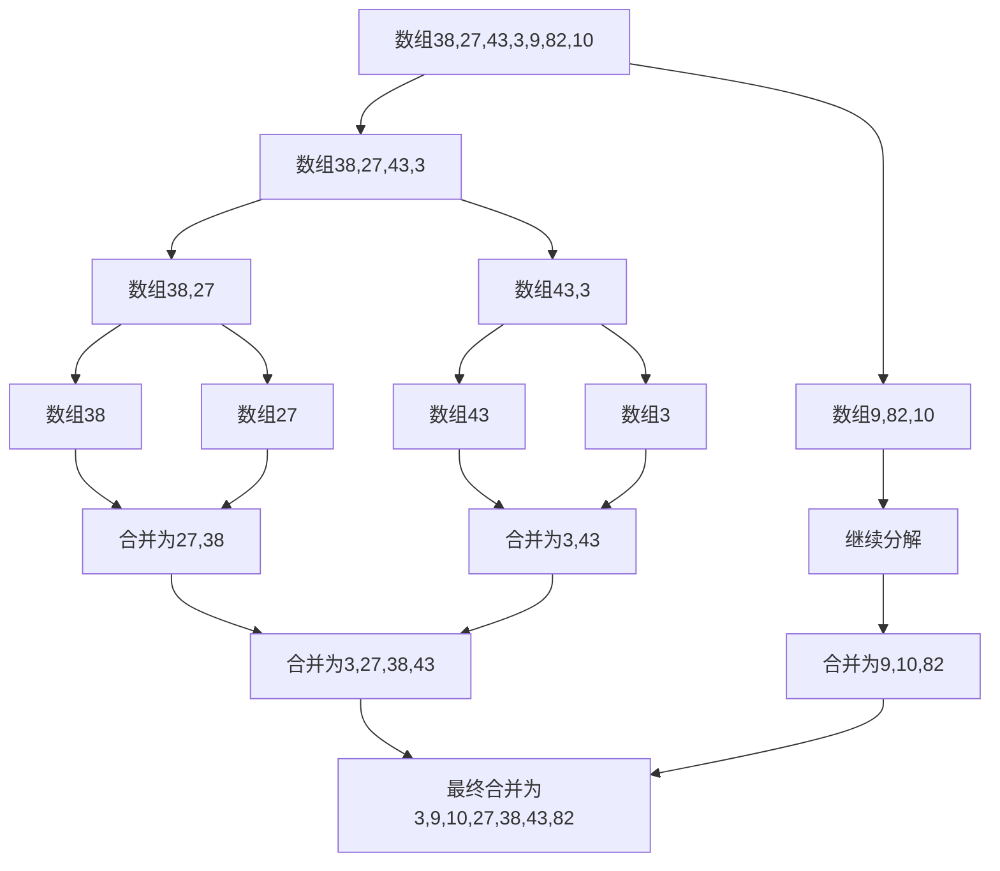

### 递归复杂度分析：主定理

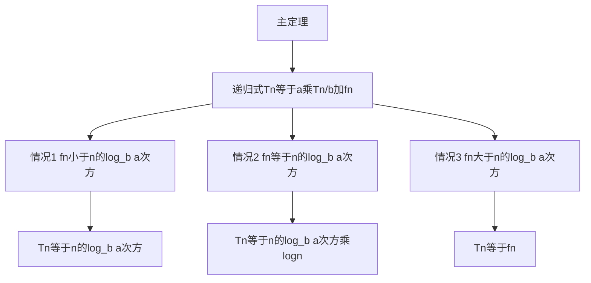

### 主定理应用示例

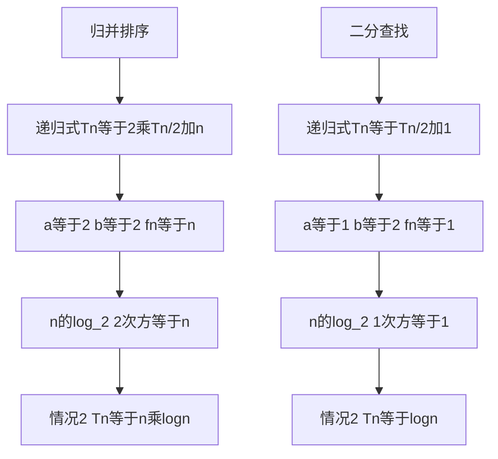

---

## 搜索算法：DFS vs BFS

### DFS与BFS对比

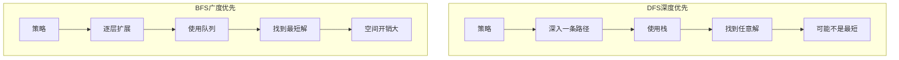

### 搜索树可视化

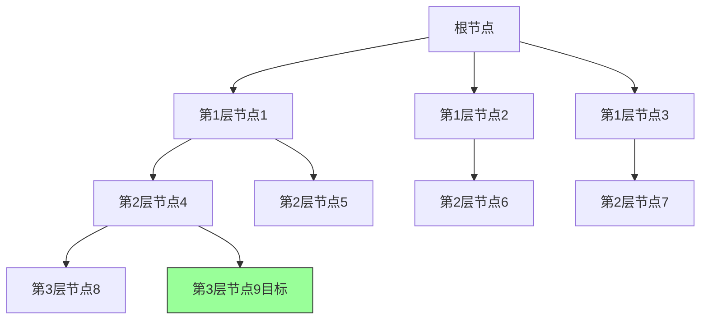

### DFS搜索路径

```mermaid
sequenceDiagram
    participant Stack as 栈
    participant Node as 当前节点
    participant Found as 是否目标
    
    Note over Stack: 初始包含根节点
    Stack->>Node: pop取出根节点
    Node->>Found: 不是目标
    Found-->>Stack: push添加子节点
    
    Stack->>Node: pop取出子节点
    Node->>Found: 不是目标
    Found-->>Stack: push添加子节点
    
    Note over Stack: 继续深入
```

### BFS搜索路径

```mermaid
sequenceDiagram
    participant Queue as 队列
    participant Node as 当前节点
    participant Found as 是否目标
    
    Note over Queue: 初始包含根节点
    Queue->>Node: dequeue取出根节点
    Node->>Found: 不是目标
    Found-->>Queue: enqueue添加子节点
    
    Queue->>Node: dequeue取出子节点
    Node->>Found: 不是目标
    Found-->>Queue: enqueue添加子节点
    
    Note over Queue: 逐层扩展
```

### 适用场景分析

```mermaid
flowchart TD
    A[选择搜索算法] --> B{问题需求}
    B -->|找最短路径| C[BFS]
    B -->|找任意解| D[DFS]
    B -->|空间受限| E[DFS]
    B -->|解在浅层| F[BFS]
    
    C --> G[队列实现]
    D --> H[栈实现或递归]
    E --> I[递归栈空间小]
    F --> J[避免深入无效路径]
```

### 空间复杂度对比

```mermaid
flowchart TD
    A[空间复杂度] --> B[DFS]
    A --> C[BFS]
    
    B --> D[Od其中d为最大深度]
    D --> E[只存储当前路径]
    
    C --> F[Ob的d次方其中b为分支因子]
    F --> G[存储整层节点]
```

### 搜索算法优化

```mermaid
flowchart TD
    A[搜索优化] --> B[剪枝]
    A --> C[启发式搜索]
    A --> D[双向搜索]
    A --> E[迭代加深]
    
    B --> F[提前终止无效分支]
    C --> G[优先搜索更有希望的节点]
    D --> H[从起点和终点同时搜索]
    E --> I[限制深度逐步增加]
```

---

## 算法复杂度总结

### 各算法复杂度对比表

```mermaid
graph TD
    subgraph exp1 [实验一算法]
        A1[哈希表查找] --> B1[时间On平均]
        B1 --> C1[空间On]
        
        A2[快速排序] --> B2[时间Onlogn平均]
        B2 --> C2[空间Ologn递归栈]
    end
    
    subgraph exp2 [实验二算法]
        A3[格雷码递归] --> B3[时间On乘2的n次方]
        B3 --> C3[空间On乘2的n次方]
        
        A4[BFS搜索] --> B4[时间On的立方]
        B4 --> C4[空间On的立方]
    end
```

### 复杂度层级图

```mermaid
flowchart TD
    A[O1常数] --> B[Ologn对数]
    B --> C[On线性]
    C --> D[Onlogn]
    D --> E[On平方]
    E --> F[On立方]
    F --> G[O2的n次方指数]
    G --> H[On阶乘阶乘]
```

### 复杂度增长曲线

```mermaid
flowchart LR
    subgraph n10 [n等于10时]
        A1[O1等于1] --> B1[On等于10]
        B1 --> C1[On平方等于100]
        C1 --> D1[O2的n次方等于1024]
    end
    
    subgraph n100 [n等于100时]
        A2[O1等于1] --> B2[On等于100]
        B2 --> C2[On平方等于10000]
        C2 --> D2[O2的n次方等于10的30次方]
    end
```

### 空间复杂度对比

```mermaid
flowchart TD
    A[空间复杂度] --> B[O1原地算法]
    A --> C[Ologn递归栈]
    A --> D[On线性空间]
    A --> E[On平方二维数组]
    
    B --> F[堆排序]
    C --> G[快速排序]
    D --> H[归并排序]
    E --> I[动态规划表格]
```

---

## 算法设计方法论

### 问题解决流程

```mermaid
flowchart TD
    A[理解问题] --> B[分析输入输出]
    B --> C[识别问题类型]
    C --> D[选择算法策略]
    D --> E[设计算法]
    E --> F[分析复杂度]
    F --> G[实现与测试]
    G --> H{是否满足要求?}
    H -->|是| I[完成]
    H -->|否| J[优化或换策略]
    J --> D
```

### 问题类型识别

```mermaid
flowchart TD
    A[问题类型] --> B[查找问题]
    A --> C[排序问题]
    A --> D[优化问题]
    A --> E[搜索问题]
    A --> F[组合问题]
    
    B --> G[哈希表或二分查找]
    C --> H[快速排序或归并排序]
    D --> I[贪心或动态规划]
    E --> J[DFS或BFS]
    F --> K[回溯或分治]
```

### 算法策略选择

```mermaid
flowchart TD
    A[问题特征] --> B{最优子结构?}
    B -->|是| C{子问题重叠?}
    C -->|是| D[动态规划]
    C -->|否| E[贪心算法]
    
    B -->|否| F{可分解?}
    F -->|是| G[分治算法]
    F -->|否| H[暴力搜索]
    
    H --> I{搜索空间大?}
    I -->|是| J[启发式搜索]
    I -->|否| K[回溯算法]
```

### 动态规划适用条件

```mermaid
flowchart TD
    A[动态规划] --> B[最优子结构]
    A --> C[子问题重叠]
    A --> D[无后效性]
    
    B --> E[子问题最优解构成原问题最优解]
    C --> F[相同子问题多次出现]
    D --> G[当前状态不受未来决策影响]
```

### 贪心算法适用条件

```mermaid
flowchart TD
    A[贪心算法] --> B[贪心选择性质]
    A --> C[最优子结构]
    
    B --> D[局部最优选择导致全局最优]
    C --> E[子问题最优解构成原问题最优解]
    
    F[注意] --> G[贪心不一定得到最优解]
    G --> H[需要证明正确性]
```

### 优化思路

```mermaid
flowchart TD
    A[算法优化方向] --> B[减少时间复杂度]
    A --> C[减少空间复杂度]
    A --> D[减少常数因子]
    
    B --> E[更好的算法策略]
    B --> F[利用问题特性]
    B --> G[预处理]
    
    C --> H[空间换时间]
    C --> I[原地算法]
    C --> J[数据结构优化]
    
    D --> K[减少不必要的操作]
    D --> L[循环优化]
    D --> M[缓存友好设计]
```

### 算法设计原则

```mermaid
mindmap
  root((算法设计原则))
    正确性
      满足问题要求
      处理边界情况
      验证测试
    效率
      时间复杂度低
      空间复杂度低
      实际运行快
    可读性
      代码清晰
      注释充分
      结构合理
    可扩展性
      易于修改
      支持新功能
      模块化设计
```

### 常见错误与避免

```mermaid
flowchart TD
    A[常见错误] --> B[边界条件处理]
    A --> C[复杂度分析错误]
    A --> D[递归出口遗漏]
    A --> E[状态去重遗漏]
    
    B --> F[检查空输入和极端值]
    C --> G[考虑最坏情况]
    D --> H[明确递归终止条件]
    E --> I[记录已访问状态]
```

---

## 总结

### 核心知识点汇总

| 类别 | 知识点 | 关键理解 |
|------|--------|----------|
| 哈希表 | 链地址法/开放地址法 | 冲突处理策略 |
| 排序 | 快速排序优化 | 基准选择、三路分区 |
| 递归 | 主定理 | 递归复杂度分析 |
| 分治 | 分解-解决-合并 | 问题分解策略 |
| 搜索 | DFS vs BFS | 最短路径 vs 任意解 |

### 算法设计流程总结

```mermaid
flowchart TD
    A[问题] --> B[建模]
    B --> C[选择策略]
    C --> D[设计算法]
    D --> E[分析复杂度]
    E --> F[实现]
    F --> G[测试验证]
    G --> H{满足要求?}
    H -->|是| I[完成]
    H -->|否| J[优化]
    J --> C
```

---

## 参考资料

1. 《算法导论》- Thomas H. Cormen
2. 《数据结构与算法分析》- Mark Allen Weiss
3. 《算法设计手册》- Steven S. Skiena
4. 《算法》- Robert Sedgewick